---
## Front matter
lang: ru-RU
title: Лабораторная работа №1
subtitle: Подготовка рабочего пространства. Работа с Git и Markdown 
author:
  - Чванова Ангелина Дмитриевна
institute:
  - Российский университет дружбы народов, Москва, Россия
date: 10 февраля 2024

babel-lang: russian
babel-otherlangs: english
mainfont: Arial
monofont: Courier New
fontsize: 12pt

## Formatting pdf
toc: false
toc-title: Содержание
slide_level: 2
aspectratio: 169
section-titles: true
theme: metropolis
header-includes:
 - \metroset{progressbar=frametitle,sectionpage=progressbar,numbering=fraction}
 - '\makeatletter'
 - '\beamer@ignorenonframefalse'
 - '\makeatother'
---
# Информация

## Докладчик

:::::::::::::: {.columns align=center}
::: {.column width="70%"}

  * Чванова Ангелина Дмитриевна
  * студент
  * Российский университет дружбы народов
  * [angelinachdm@gmail.com](mailto:angelinachdm@gmail.com)
  * <https://adchvanova-new.github.io/ru/>

:::
::: {.column width="30%"}

:::
::::::::::::::

# Актуальность

- Востребованность систем контроля версий: В сфере разработки программного обеспечения системы контроля версий играют ключевую роль, обеспечивая координацию работы нескольких разработчиков над общим проектом. Это позволяет эффективно управлять изменениями, отслеживать их и возвращаться к предыдущим версиям при необходимости.

- GitHub как важный инструмент для разработчиков: GitHub является основным ресурсом для совместной работы над проектами, особенно в открытом исходном коде. Знание его принципов и возможностей является важным навыком для разработчиков и специалистов в области информационных технологий.

# Актуальность
- Markdown для удобной разметки: Markdown становится все более популярным выбором для написания документации, отчетов и презентаций благодаря своей простоте и удобству. Умение работать с Markdown позволяет создавать читаемый и структурированный контент с минимальными усилиями.

- Конвертация в различные форматы: В современном мире требуется гибкость в предоставлении результатов работы. Возможность конвертировать отчеты и презентации в различные форматы, такие как DOCX, PDF и HTML, обеспечивает удобство и доступность для аудитории.

# Объект и предмет исследования

- GitHub
- Markdown
- Работа с репозиториями

## Цели и задачи

 Настроить рабочее пространство для лабораторной работы. Изучить идеологию и применение средств контроля версий,  а также освоить умения по работе с git. Основить работу с Markdown.

# Материалы и методы

- Git: Использовалась версионная система Git для управления версиями кода и документации.
- GitHub: Для хостинга и совместной работы над проектом был использован веб-сервис GitHub.
- Markdown: Для написания отчета и презентации использовался язык разметки Markdown.
- Конвертация в различные форматы: Для конвертации отчета и презентации в другие форматы, такие как DOCX, PDF и HTML, была использована утилита Pandoc.

# Выполнение лабораторной работы

1. Подготовка GitHub. Установка имени и электронной почты. Получение ключа.
 (рис. [-@fig:001]).

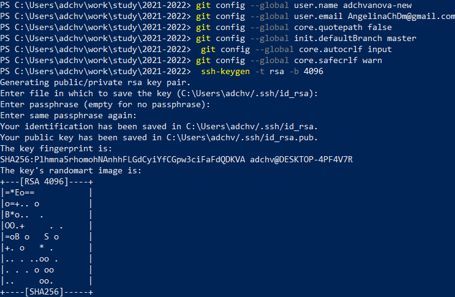{#fig:001 width=70%}

# Выполнение лабораторной работы

2. Создание рабочего пространства с помощью утилит:
 (рис. [-@fig:002]).

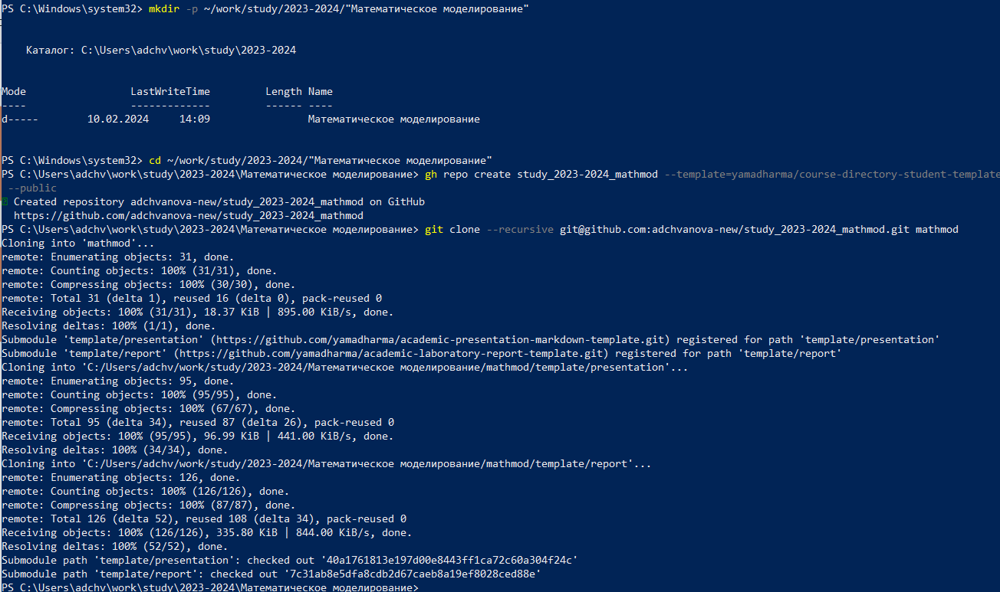{#fig:002 width=70%}

# Выполнение лабораторной работы

3. Проверка репозитория на GitHub
Открываем гитхаб и видим, что репозиторий успешно клонирован (рис. [-@fig:003]).

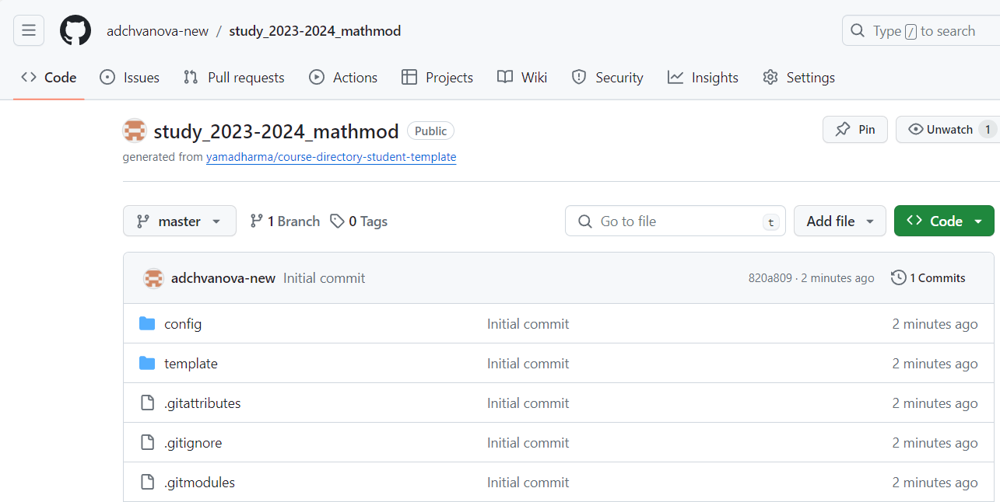{#fig:003 width=70%}

# Выполнение лабораторной работы

4. Настройка каталога курса
(рис. [-@fig:004]).

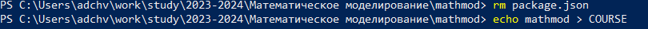{#fig:004 width=60%}
 (рис. [-@fig:005]).

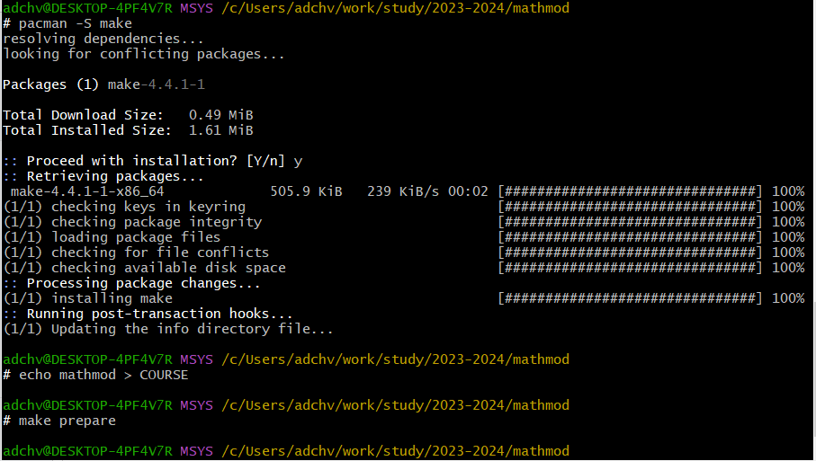{#fig:005 width=60%}

# Выполнение лабораторной работы

5. Отправка файлов на сервер: 
 (рис. [-@fig:006]-[-@fig:007]).

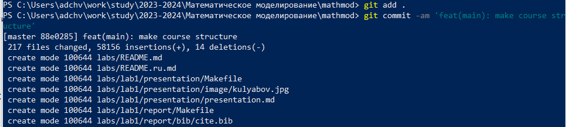{#fig:006 width=60%}
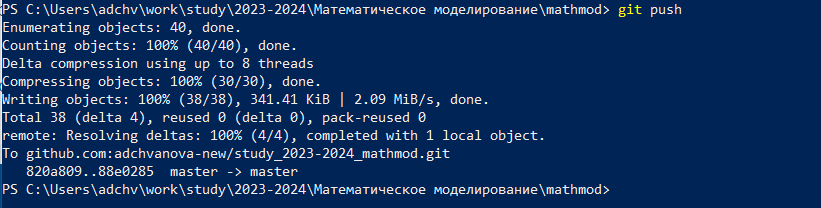{#fig:007 width=60%}

# Выполнение лабораторной работы

6. Установка pandoc и MikTex
 (рис. [-@fig:008]-[-@fig:009]).

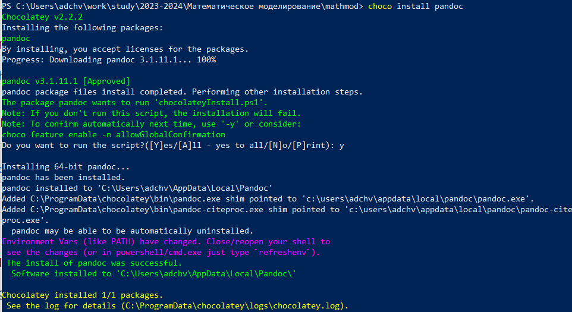{#fig:008 width=60%}
{#fig:009 width=60%}

# Выполнение лабораторной работы

7. Конвертация отчета

 (рис. [-@fig:010]- [-@fig:011]).

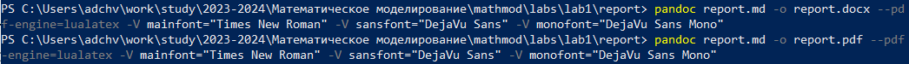{#fig:010 width=60%}
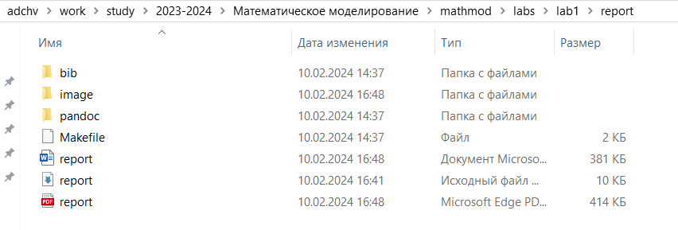{#fig:011 width=60%}

# Выполнение лабораторной работы

8. Конвертация презентации

 (рис. [-@fig:012]- [-@fig:013]).

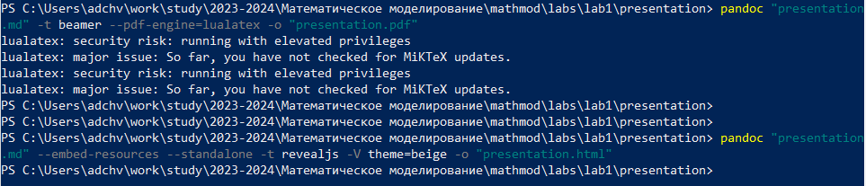{#fig:012 width=60%}
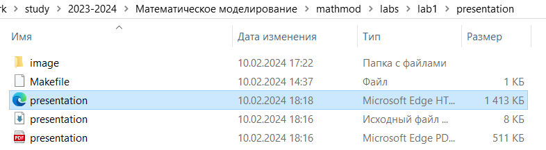{#fig:013 width=60%}

# Выводы

 Нами было настроено рабочее пространство для лабораторной работы и изучена идеология и применение средств контроля версий,  а также освоены умения по работе с git и Markdown.

# Список литературы{.unnumbered}

•	Документация по Git: https://git-scm.com/book/ru/v2

•	Документация по Markdown: https://learn.microsoft.com/ru-ru/contribute/markdown-reference

•	Документация по MiKTeX: https://kpfu.ru/staff_files/F2077692752/Inst_MiKTeX.pdf

