---
## Front matter
title: "Отчёт по лабораторной работе 1"
subtitle: "Настройка рабочего пространства. Система контроля версий Git. Язык разметки Markdown."
author: "Чванова Ангелина Дмитриевна, НПИбд-02-21"

## Generic otions
lang: ru-RU
toc-title: "Содержание"

## Bibliography
bibliography: bib/cite.bib
csl: pandoc/csl/gost-r-7-0-5-2008-numeric.csl

## Pdf output format
toc: true # Table of contents
toc-depth: 2
lof: true # List of figures
lot: true # List of tables
fontsize: 12pt
linestretch: 1.5
papersize: a4
documentclass: scrreprt
## I18n polyglossia
polyglossia-lang:
  name: russian
  options:
	- spelling=modern
	- babelshorthands=true
polyglossia-otherlangs:
  name: english
## I18n babel
babel-lang: russian
babel-otherlangs: english
## Fonts
mainfont: PT Serif
romanfont: PT Serif
sansfont: PT Sans
monofont: PT Mono
mainfontoptions: Ligatures=TeX
romanfontoptions: Ligatures=TeX
sansfontoptions: Ligatures=TeX,Scale=MatchLowercase
monofontoptions: Scale=MatchLowercase,Scale=0.9
## Biblatex
biblatex: true
biblio-style: "gost-numeric"
biblatexoptions:
  - parentracker=true
  - backend=biber
  - hyperref=auto
  - language=auto
  - autolang=other*
  - citestyle=gost-numeric
## Pandoc-crossref LaTeX customization
figureTitle: "Рис."
tableTitle: "Таблица"
listingTitle: "Листинг"
lofTitle: "Список иллюстраций"
lotTitle: "Список таблиц"
lolTitle: "Листинги"
## Misc options
indent: true
header-includes:
  - \usepackage{indentfirst}
  - \usepackage{float} # keep figures where there are in the text
  - \floatplacement{figure}{H} # keep figures where there are in the text
---

# Цель работы
 Настроить рабочее пространство для лабораторной работы. Изучить идеологию и применение средств контроля версий,  а также освоить умения по работе с git. Основить работу с Markdown.

# Задание

– Создать базовую конфигурацию для работы с git.
– Создать локальный каталог для выполнения заданий по предмету.
- Написание отчета и презентации с помощью Markdown.
- Конвертация отчета и презентации во все необходимые форматы.

# Теоретическое введение

## Системы контроля версий. Общие понятия
Системы контроля версий (Version Control System, VCS) применяются при работе нескольких человек над одним проектом. Обычно основное дерево проекта хранится в локальном
или удалённом репозитории, к которому настроен доступ для участников проекта. При
внесении изменений в содержание проекта система контроля версий позволяет их
фиксировать, совмещать изменения, произведённые разными участниками проекта,
производить откат к любой более ранней версии проекта, если это требуется.
В классических системах контроля версий используется централизованная модель,
предполагающая наличие единого репозитория для хранения файлов. Выполнение большинства функций по управлению версиями осуществляется специальным сервером.
Участник проекта (пользователь) перед началом работы посредством определённых
команд получает нужную ему версию файлов. После внесения изменений, пользователь
размещает новую версию в хранилище. При этом предыдущие версии не удаляются
из центрального хранилища и к ним можно вернуться в любой момент. Сервер может
сохранять не полную версию изменённых файлов, а производить так называемую дельтакомпрессию — сохранять только изменения между последовательными версиями, что позволяет уменьшить объём хранимых данных

## GitHub
 GitHub— крупнейший веб-сервис для хостинга IT-проектов и их совместной разработки.Веб-сервис основан на системе контроля версий Git и разработан на Ruby on Rails[7] и Erlang компанией GitHub, Inc (ранее Logical Awesome). Сервис бесплатен для проектов с открытым исходным кодом и (с 2019 года) небольших частных проектов, предоставляя им все возможности (включая SSL), а для крупных корпоративных проектов предлагаются различные платные тарифные планы.

 ## Markdown
 Markdown — это облегченный язык разметки с синтаксисом форматирования обычного текста. Документация поддерживает разметку Markdown в соответствии с CommonMark и ее синтаксический анализ через подсистему Markdig. Документация также поддерживает пользовательские расширения Markdown, которые предоставляют более обширный контент на сайте документации.

# Выполнение лабораторной работы

1. Подготовка GitHub. Установка имени и электронной почты. Получение ключа.
Выполняем следующие команды, чтобы git узнал наше имя и
электронную почту (рис. [-@fig:001]).

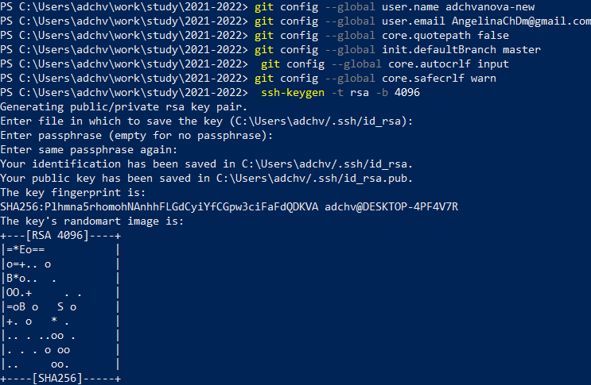{#fig:001 width=70%}

2. Создание рабочего пространства с помощью утилит:
mkdir -p ~/work/study/2023-2024/"Математическое моделирование"
cd ~/work/study/2023-2024/"Математическое моделирование"
gh repo create study_2023-2024_mathmod --template=yamadharma/course-directory-student-template --public
git clone --recursive git@github.com:adchvanova-new/study_2023-2024_mathmod.git mathmod
 (рис. [-@fig:002]).

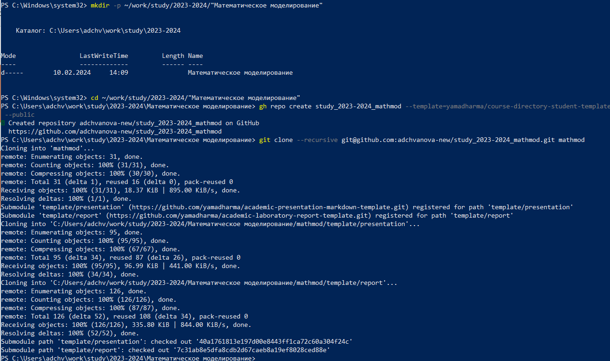{#fig:002 width=70%}
3. Проверка репозитория на GitHub
Открываем гитхаб и видим, что репозиторий успешно клонирован (рис. [-@fig:003]).

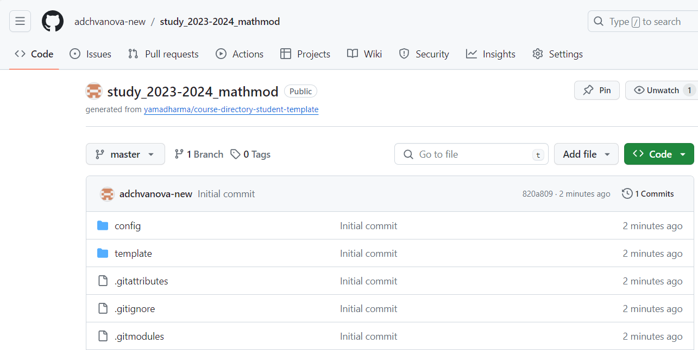{#fig:003 width=70%}

4. Настройка каталога курса
Переход в каталог курса:

cd ~/work/study/2023-2024/"Математическое моделирование"/mathmod
Удаление лишних файлов:

rm package.json (рис. [-@fig:004]).

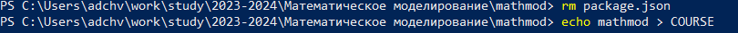{#fig:004 width=70%}

 Переход в msys2 и установка make. Затем мы прописываем команды для создания необходимых каталогов:
 echo mathmod > COURSE
 make prepare
 (рис. [-@fig:005]).

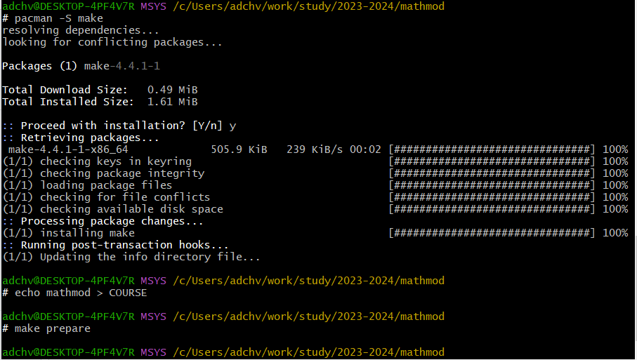{#fig:005 width=70%}

5. Отправка файлов на сервер: 
 git add .
 git commit -am 'feat(main): make course structure'
 git push
 (рис. [-@fig:006]-[-@fig:007]).

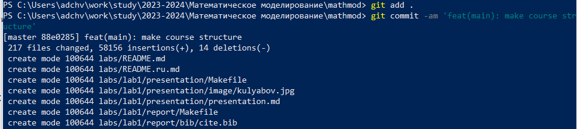{#fig:006 width=70%}
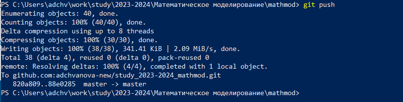{#fig:007 width=70%}

6. Установка pandoc и MikTex
 (рис. [-@fig:008]-[-@fig:009]).

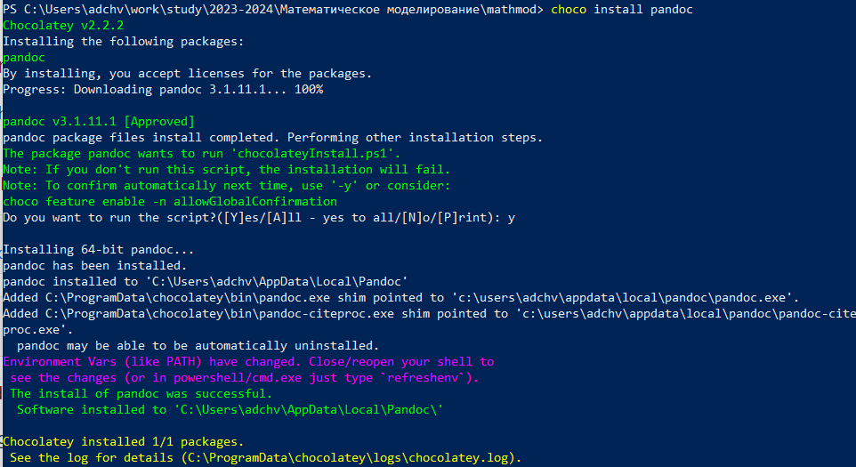{#fig:008 width=70%}
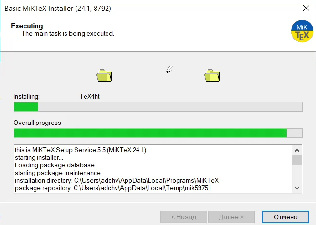{#fig:009 width=70%}

7. Конвертация отчета
В docx:
pandoc report.md -o report.docx --pdf-engine=lualatex -V mainfont="Times New Roman" -V sansfont="DejaVu Sans" -V monofont="DejaVu Sans Mono"
В pdf:
pandoc report.md -o report.pdf --pdf-engine=lualatex -V mainfont="Times New Roman" -V sansfont="DejaVu Sans" -V monofont="DejaVu Sans Mono"
 (рис. [-@fig:010]- [-@fig:011]).

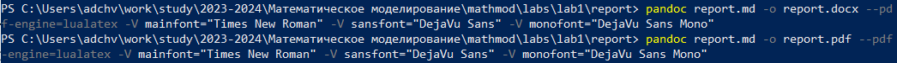{#fig:010 width=70%}
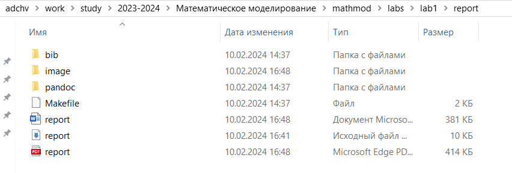{#fig:011 width=70%}

8. Конвертация презентации
В pdf:
pandoc "presentation.md" -t beamer --pdf-engine=lualatex -o "presentation.pdf"
В html:
pandoc "presentation.md" --embed-resources --standalone -t revealjs -V theme=beige -o "presentation.html"

 (рис. [-@fig:012]- [-@fig:013]).

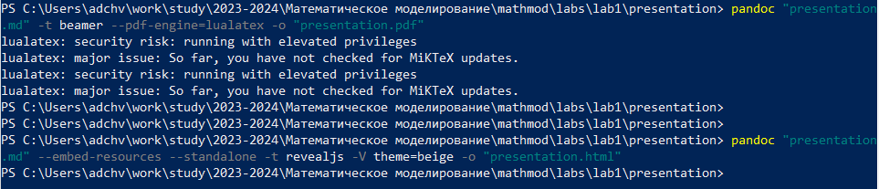{#fig:012 width=70%}
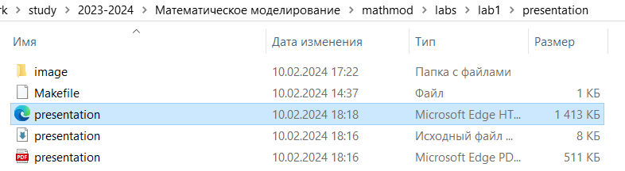{#fig:013 width=70%}

# Выводы

 Нами было настроено рабочее пространство для лабораторной работы и изучена идеология и применение средств контроля версий,  а также освоены умения по работе с git и Markdown.

# Список литературы{.unnumbered}

•	Документация по Git: https://git-scm.com/book/ru/v2

•	Документация по Markdown: https://learn.microsoft.com/ru-ru/contribute/markdown-reference

•	Документация по MiKTeX: https://kpfu.ru/staff_files/F2077692752/Inst_MiKTeX.pdf

