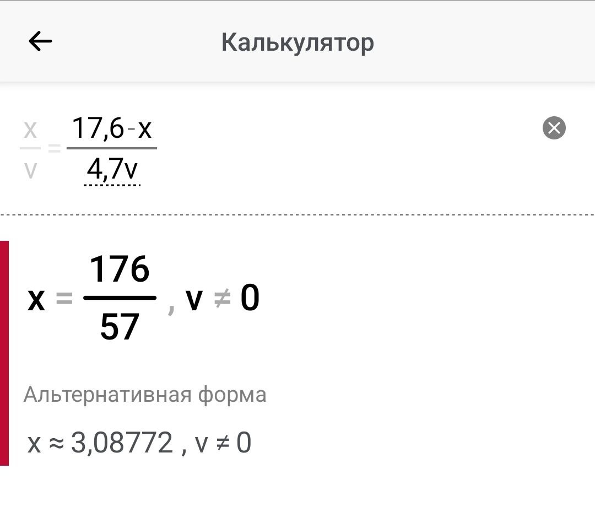
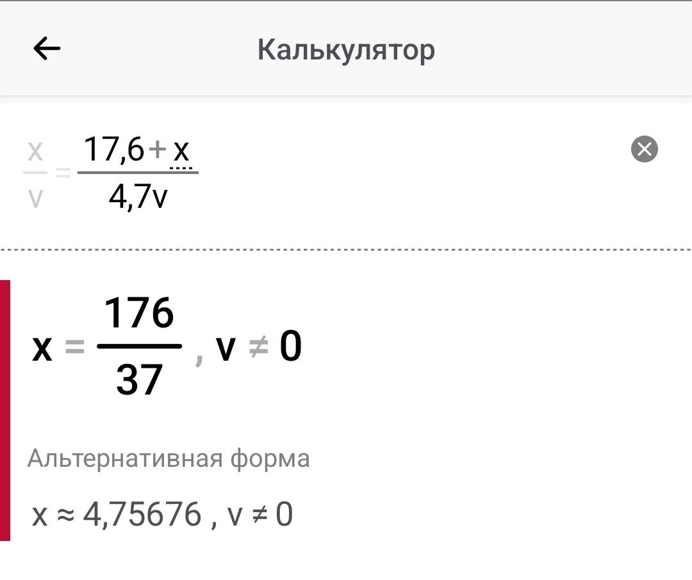
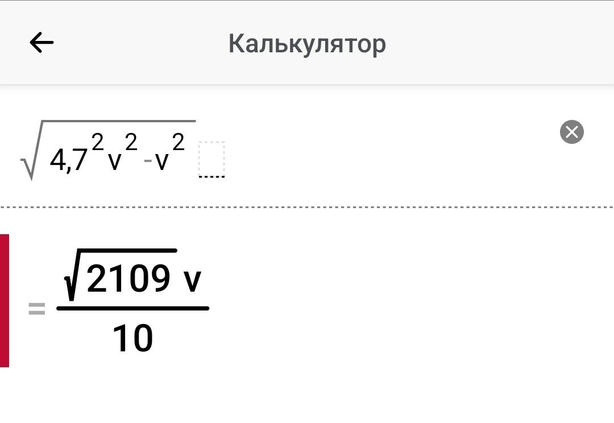
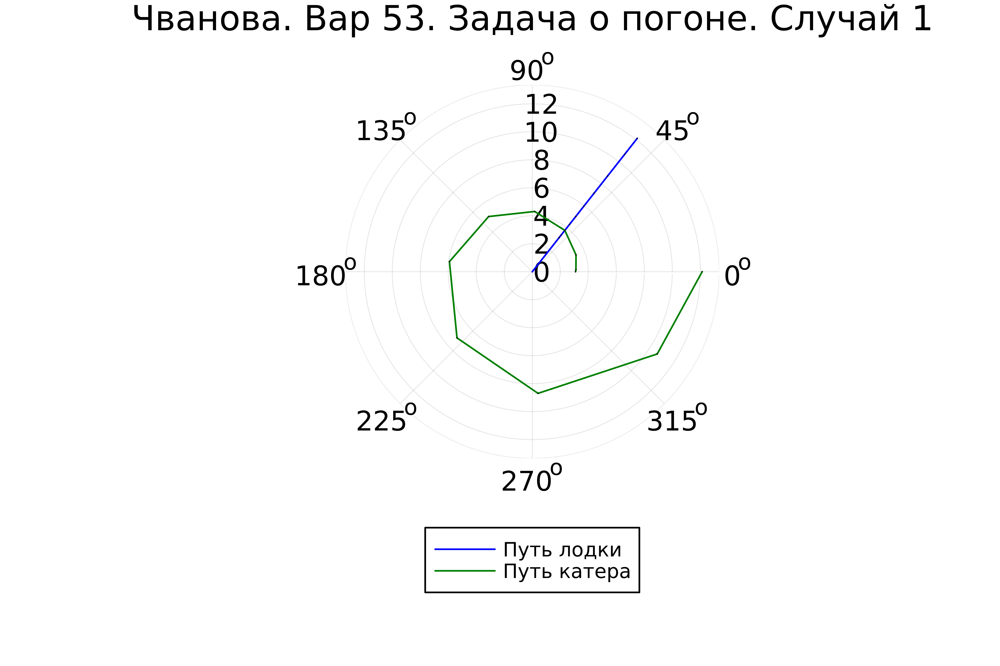
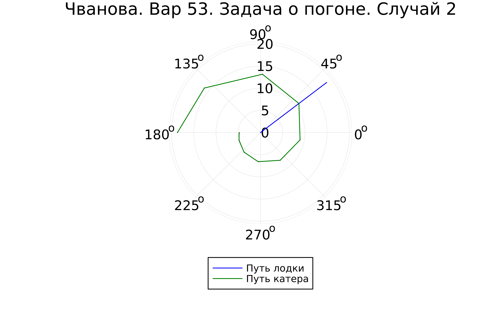

---
## Front matter
lang: ru-RU
title: Лабораторная работа №2
subtitle: Задача о погоне. Вариант 53
author:
  - Чванова Ангелина Дмитриевна
institute:
  - Российский университет дружбы народов, Москва, Россия
date: 10 февраля 2024

babel-lang: russian
babel-otherlangs: english
mainfont: Arial
monofont: Courier New
fontsize: 12pt

## Formatting pdf
toc: false
toc-title: Содержание
slide_level: 2
aspectratio: 169
section-titles: true
theme: metropolis
header-includes:
 - \metroset{progressbar=frametitle,sectionpage=progressbar,numbering=fraction}
 - '\makeatletter'
 - '\beamer@ignorenonframefalse'
 - '\makeatother'
---
# Информация

## Докладчик

:::::::::::::: {.columns align=center}
::: {.column width="70%"}

  * Чванова Ангелина Дмитриевна
  * студент
  * Российский университет дружбы народов
  * [angelinachdm@gmail.com](mailto:angelinachdm@gmail.com)
  * <https://adchvanova-new.github.io/ru/>

:::
::: {.column width="30%"}

:::
::::::::::::::

# Цель работы

Решение задачи о погоне, а также изучение основ языка программирования Julia.

# Задачи

1. Запишите уравнение, описывающее движение катера, с начальными условиями для двух случаев (в зависимости от расположения катера относительно лодки в начальный момент времени).

2. Постройте траекторию движения катера и лодки для двух случаев.

3. Найдите точку пересечения траектории катера и лодки

# Теоретическое введение

## Julia
Julia – это открытый свободный высокопроизводительный динамический язык высокого уровня, созданный специально для технических (математических) вычислений. Его синтаксис близок к синтаксису других сред технических вычислений, таких как Matlab и Octave. Он имеет в своем составе сложный компилятор, обеспечивает распределенное параллельное выполнение инструкций, вычислительную точность и обширную библиотеку математических функций.Имеет встроенную поддержку многопоточности и распределённых вычислений, реализованные в том числе в стандартных конструкциях.

# Выполнение лабораторной работы

Выбор варианта вычислялся остатком от деления студенческого билета на количесвто вариантов, плюс один. Таким образом Получили 53 вариант (Рис.1).

{#fig:001 width=70%}

# Произведение расчетов

Начальные координаты катера (17,6; 0). Обозначим скорость лодки $v$.

Чтобы найти расстояние x (расстояние после которого катер начнет двигаться вокруг полюса), необходимо составить следующие уравнение. 

$$ \left[ \begin{array}{cl}
{{x}/{v}} = {({17,6 - x})/{4,7v}}\\
{{x}/{v}} = {({17,6 + x})/{4,7v}}
\end{array} \right. $$

Из данных уравнений можно найти расстояние, после которого катер начнёт раскручиваться по спирали. Для данных уравнений решения будут следующими(Рис.2-3): $x_1 = {{176}/{57}}$, $x_2 = {{176}/{37}}$. 

{#fig:002 width=30%}

{#fig:003 width=30%}

# Произведение расчетов

Задачу решаем для 2 случаев. После того, как катер береговой охраны окажется на одном расстоянии от полюса, что и лодка, он должен сменить прямолинейную траекторию и начать двигаться вокруг полюса удаляясь от него со скоростью лодки v.
Для этого скорость катера раскладываем на две составляющие: $v_r = {dr/ dt} = v$ - радиальная скорость и $v_\tau = r{d\theta/ dt}$ - тангенциальная скорость (Рис.4).

$$ v_\tau = {{sqrt{2109}v}/{10}} $$

{#fig:004 width=30%}

# Произведение расчетов

 Решение исходной задачи сводится к решению системы из двух дифференциальных уравнений:

$$ \left\{ \begin{array}{cl}
{dr/ dt} = v \\
r{d\theta/ dt} = {{sqrt{2109}v}/{10}}
\end{array} \right. $$

с начальными условиями 

$$ \left\{ \begin{array}{cl}
\theta_0 = 0 \\
r_0 = x_1 = {{176}/{57}}
\end{array} \right. $$

# Произведение расчетов

или

$$ \left\{ \begin{array}{cl}
\theta_0 = -\pi \\
r_0 = x_2 = {{176}/{37}}
\end{array} \right. $$

Исключая из полученной системы производную по t, можно перейти к следующему уравнению (с неизменными начальными условиями):

$$ {dr/ d\theta} = {10r/sqrt{2109}} $$

# Моделирование

OpenModelica не может быть использована для этой задачи, так как здесь используются полярные координаты.

Установка Julia и необходимх для нее пакетов (Рис.5).

{#fig:005 width=70%}

# Результаты работы

Запуск программы и получение результатов (Рис.7-9):
{#fig:007 width=70%}

# Результаты работы

{#fig:008 width=70%}

# Результаты работы

{#fig:009 width=70%}

# Выводы

Нами была решена задача о погоне, а также изучены основы языка программирования Julia, были выполнили все поставленные задачи: построение графиков для обоих случаев, где получилось отрисовать трактерию катера, траекторию лодки и получилось наглядно найти их точки пересечения. 
