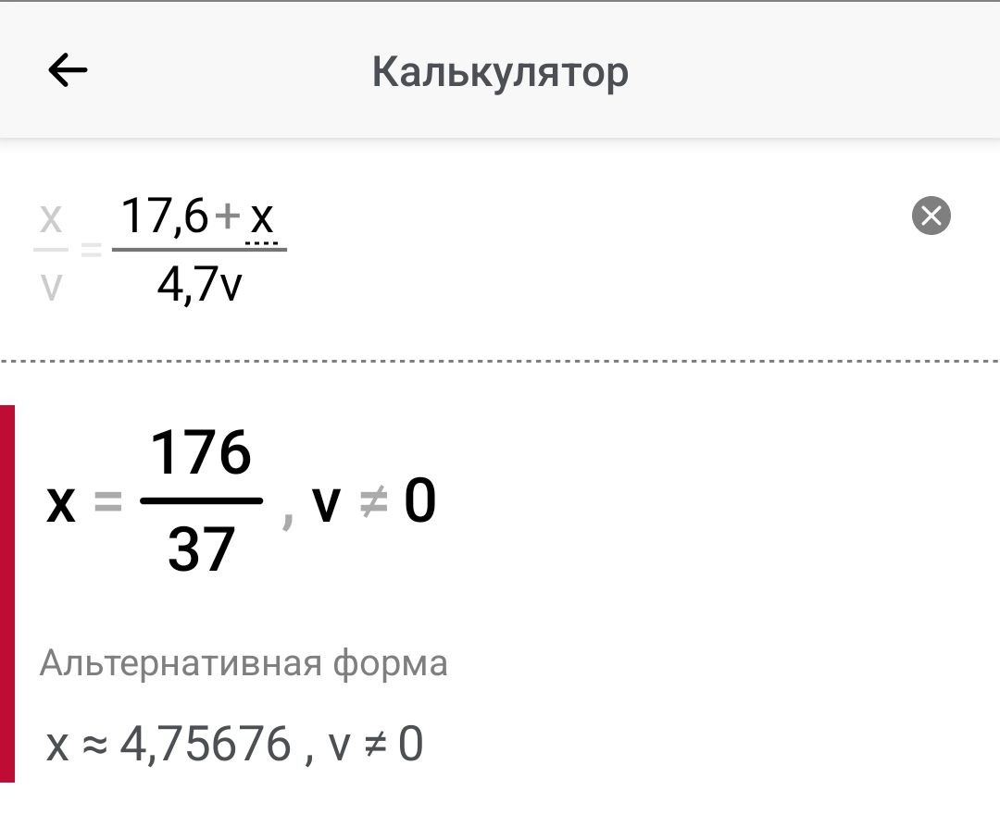
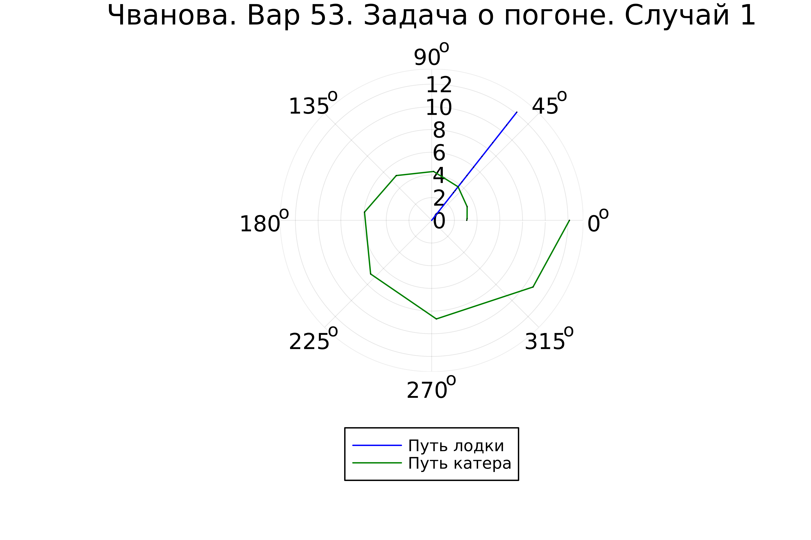
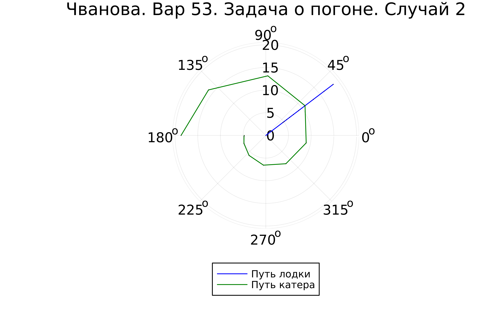

---
## Front matter
title: "Лабораторная работа №2"
subtitle: "Задача о погоне. Вариант 53"
author: "Чванова Ангелина Дмитриевна, НПИбд-02-21"

## Generic otions
lang: ru-RU
toc-title: "Содержание"

## Bibliography
bibliography: bib/cite.bib
csl: pandoc/csl/gost-r-7-0-5-2008-numeric.csl

## Pdf output format
toc: true # Table of contents
toc-depth: 2
lof: true # List of figures
fontsize: 12pt
linestretch: 1.5
papersize: a4
documentclass: scrreprt
## I18n polyglossia
polyglossia-lang:
  name: russian
  options:
	- spelling=modern
	- babelshorthands=true
polyglossia-otherlangs:
  name: english
## I18n babel
babel-lang: russian
babel-otherlangs: english
## Fonts
mainfont: PT Serif
romanfont: PT Serif
sansfont: PT Sans
monofont: PT Mono
mainfontoptions: Ligatures=TeX
romanfontoptions: Ligatures=TeX
sansfontoptions: Ligatures=TeX,Scale=MatchLowercase
monofontoptions: Scale=MatchLowercase,Scale=0.9
## Biblatex
biblatex: true
biblio-style: "gost-numeric"
biblatexoptions:
  - parentracker=true
  - backend=biber
  - hyperref=auto
  - language=auto
  - autolang=other*
  - citestyle=gost-numeric

## Pandoc-crossref LaTeX customization
figureTitle: "Скриншот"
tableTitle: "Таблица"
listingTitle: "Листинг"
lofTitle: "Список иллюстраций"
lotTitle: "Список таблиц"
lolTitle: "Листинги"
## Misc options
indent: true
header-includes:
  - \usepackage{indentfirst}
  - \usepackage{float} # keep figures where there are in the text
  - \floatplacement{figure}{H} # keep figures where there are in the text
---

# Цель работы

Решение задачи о погоне, а также изучение основ языка программирования Julia.

# Задачи

1. Запишите уравнение, описывающее движение катера, с начальными условиями для двух случаев (в зависимости от расположения катера относительно лодки в начальный момент времени).

2. Постройте траекторию движения катера и лодки для двух случаев.

3. Найдите точку пересечения траектории катера и лодки

# Теоретическое введение

## Julia
Julia – это открытый свободный высокопроизводительный динамический язык высокого уровня, созданный специально для технических (математических) вычислений. Его синтаксис близок к синтаксису других сред технических вычислений, таких как Matlab и Octave. Он имеет в своем составе сложный компилятор, обеспечивает распределенное параллельное выполнение инструкций, вычислительную точность и обширную библиотеку математических функций.Имеет встроенную поддержку многопоточности и распределённых вычислений, реализованные в том числе в стандартных конструкциях.

# Выполнение лабораторной работы

Выбор варианта вычислялся остатком от деления студенческого билета на количесвто вариантов, плюс один. Таким образом Получили 53 вариант (Рис.1).

{#fig:001 width=70%}

## Произведение расчетов

1.  За момент отсчета времени примем момент первого рассеивания тумана. Введем полярные координаты с центром в точке нахождения браконьеров и осью, проходящей через катер береговой охраны. Тогда начальные координаты катера (17,6; 0). Обозначим скорость лодки $v$.

2. Траектория катера должна быть такой, чтобы и катер, и лодка все время были на одном расстоянии от полюса. Только в этом случае траектория катера пересечется с траекторией лодки. Поэтому для начала катер береговой охраны должен двигаться некоторое время прямолинейно, пока не окажется на том же расстоянии от полюса, что и лодка браконьеров. После этого катер береговой охраны должен двигаться вокруг полюса удаляясь от него с той же скоростью, что и лодка браконьеров.

3. Чтобы найти расстояние x (расстояние после которого катер начнет двигаться вокруг полюса), необходимо составить следующие уравнение. Пусть через время t катер и лодка окажутся на одном расстоянии x от полюса. За это время лодка пройдет $x$, а катер $17,6 + x$ (или $17,6 - x$, в зависимости от начального положения катера относительно полюса). Время, за которое они пройдут это расстояние, вычисляется как $x / v$ или (${17,6 - x})/{4,7v}$, ((${17,6 + x})/{4,7v}$). Так как время должно быть одинаковым, эти величины тоже будут друг другу равны. Из этого получаем объединение из двух уравнений (двух из-за двух разных изначальных позиций катера относительно полюса):

$$ \left[ \begin{array}{cl}
{{x}/{v}} = {({17,6 - x})/{4,7v}}\\
{{x}/{v}} = {({17,6 + x})/{4,7v}}
\end{array} \right. $$

Из данных уравнений можно найти расстояние, после которого катер начнёт раскручиваться по спирали. Для данных уравнений решения будут следующими(Рис.2-3): $x_1 = {{176}/{57}}$, $x_2 = {{176}/{37}}$. 

{#fig:002 width=70%}

{#fig:003 width=70%}

Задачу решаем для 2 случаев. После того, как катер береговой охраны окажется на одном расстоянии от полюса, что и лодка, он должен сменить прямолинейную траекторию и начать двигаться вокруг полюса удаляясь от него со скоростью лодки v.

Для этого скорость катера раскладываем на две составляющие: $v_r = {dr/ dt} = v$ - радиальная скорость и $v_\tau = r{d\theta/ dt}$ - тангенциальная скорость (Рис.4).

$$ v_\tau = {{sqrt{2109}v}/{10}} $$

{#fig:004 width=70%}

4. Решение исходной задачи сводится к решению системы из двух дифференциальных уравнений:

$$ \left\{ \begin{array}{cl}
{dr/ dt} = v \\
r{d\theta/ dt} = {{sqrt{2109}v}/{10}}
\end{array} \right. $$

с начальными условиями 

$$ \left\{ \begin{array}{cl}
\theta_0 = 0 \\
r_0 = x_1 = {{176}/{57}}
\end{array} \right. $$

или

$$ \left\{ \begin{array}{cl}
\theta_0 = -\pi \\
r_0 = x_2 = {{176}/{37}}
\end{array} \right. $$

Исключая из полученной системы производную по t, можно перейти к следующему уравнению (с неизменными начальными условиями):

$$ {dr/ d\theta} = {10r/sqrt{2109}} $$

Решением этого уравнения с заданными начальными условиями и будет являться траектория движения катера в полярных координатах.

## Моделирование

OpenModelica не может быть использована для этой задачи, так как здесь используются полярные координаты.

Установка Julia и необходимх для нее пакетов (Рис.5-6).

{#fig:005 width=70%}

{#fig:006 width=70%}

Исходный код программы:

using Plots
using DifferentialEquations

#расстояние от лодки до катера
const a = 17.6
const n = 4.7

#расстояние начала закругления-спирали
const r0 = a/(n + 1)
const r0_2 = a/(n - 1)

#интервал
const T = (0, 2*pi)
const T_2 = (-pi, pi)

function F(u, p, t)
    return u / sqrt(n*n - 1)
end

#задача ОДУ
problem = ODEProblem(F, r0, T)

#решение 
result = solve(problem, abstol=1e-8, reltol=1e-8)
@show result.u
@show result.t

dxR = rand(1:size(result.t)[1])
rAngles = [result.t[dxR] for i in 1:size(result.t)[1]]

#холст1
plt = plot(proj=:polar, aspect_ratio=:equal, dpi = 1000, legend=true, bg=:white)

#параметры для холста
plot!(plt, xlabel="theta", ylabel="r(t)", title="Чванова. Вар 53. Задача о погоне. Случай 1", legend=:outerbottom)
plot!(plt, [rAngles[1], rAngles[2]], [0.0, result.u[size(result.u)[1]]], label="Путь лодки", color=:blue, lw=1)
scatter!(plt, rAngles, result.u, label="", mc=:blue, ms=0.0005)
plot!(plt, result.t, result.u, xlabel="theta", ylabel="r(t)", label="Путь катера", color=:green, lw=1)
scatter!(plt, result.t, result.u, label="", mc=:green, ms=0.0005)

savefig(plt, "lab2_01.png")

problem = ODEProblem(F, r0_2 , T_2)
result = solve(problem, abstol=1e-8, reltol=1e-8)
dxR = rand(1:size(result.t)[1])
rAngles = [result.t[dxR] for i in 1:size(result.t)[1]]

#xoлст2
plt1 = plot(proj=:polar, aspect_ratio=:equal, dpi = 1000, legend=true, bg=:white)

#параметры для холста
plot!(plt1, xlabel="theta", ylabel="r(t)", title="Чванова. Вар 53. Задача о погоне. Случай 2", legend=:outerbottom)
plot!(plt1, [rAngles[1], rAngles[2]], [0.0, result.u[size(result.u)[1]]], label="Путь лодки", color=:blue, lw=1)
scatter!(plt1, rAngles, result.u, label="", mc=:blue, ms=0.0005)
plot!(plt1, result.t, result.u, xlabel="theta", ylabel="r(t)", label="Путь катера", color=:green, lw=1)
scatter!(plt1, result.t, result.u, label="", mc=:green, ms=0.0005)

savefig(plt1, "lab2_02.png")

## Результаты работы

Запуск программы и получение результатов (Рис.7-9):
{#fig:007 width=70%}

{#fig:008 width=70%}

{#fig:009 width=70%}

# Выводы

Нами была решена задача о погоне, а также изучены основы языка программирования Julia, были выполнили все поставленные задачи: построение графиков для обоих случаев, где получилось отрисовать трактерию катера, траекторию лодки и получилось наглядно найти их точки пересечения. 
