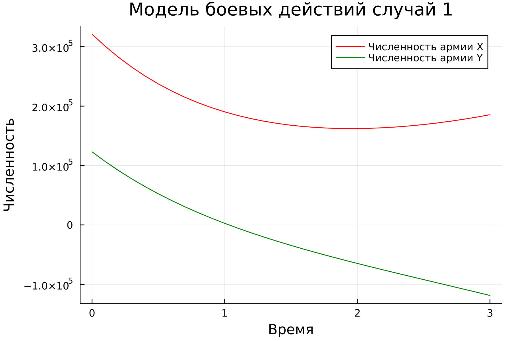
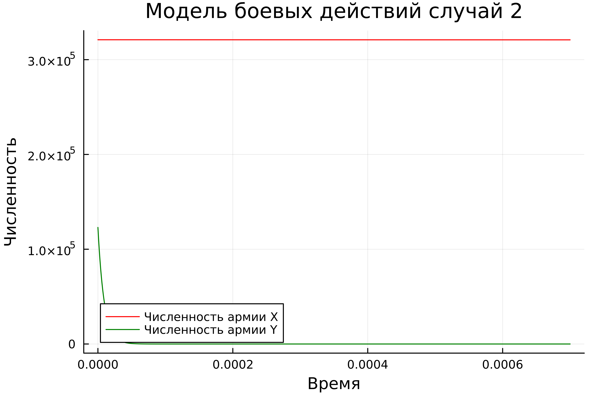
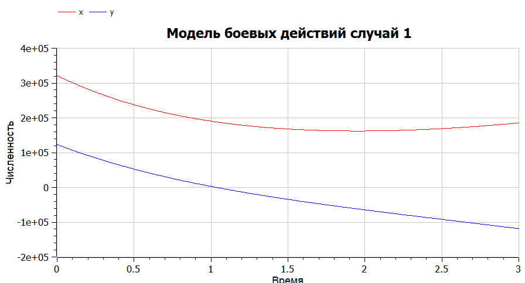
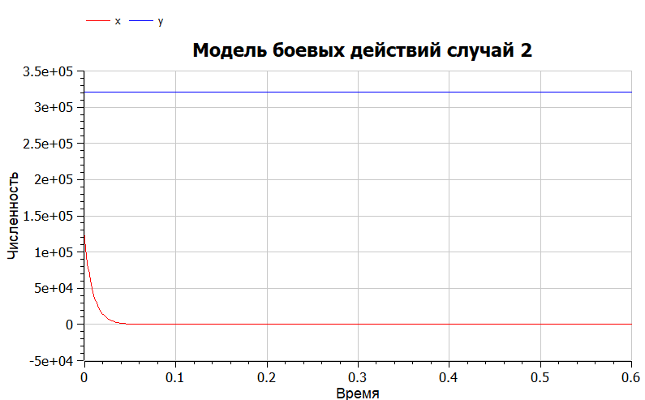

---
## Front matter
lang: ru-RU
title: Лабораторная работа №3
subtitle: Модель боевых действий. Вариант 53
author:
  - Чванова Ангелина Дмитриевна
institute:
  - Российский университет дружбы народов, Москва, Россия
date: 20 февраля 2024

babel-lang: russian
babel-otherlangs: english
mainfont: Arial
monofont: Courier New
fontsize: 12pt

## Formatting pdf
toc: false
toc-title: Содержание
slide_level: 2
aspectratio: 169
section-titles: true
theme: metropolis
header-includes:
 - \metroset{progressbar=frametitle,sectionpage=progressbar,numbering=fraction}
 - '\makeatletter'
 - '\beamer@ignorenonframefalse'
 - '\makeatother'
---
# Информация

## Докладчик

:::::::::::::: {.columns align=center}
::: {.column width="70%"}

  * Чванова Ангелина Дмитриевна
  * студент
  * Российский университет дружбы народов
  * [angelinachdm@gmail.com](mailto:angelinachdm@gmail.com)
  * <https://adchvanova-new.github.io/ru/>

:::
::: {.column width="30%"}

:::
::::::::::::::

# Цель работы

Решить задачу о модели боевых действий с помощью Julia и OpenModelica.

# Теоретическое введение

Законы Ланчестера (законы Осипова — Ланчестера) — математическая формула для расчета относительных сил пары сражающихся сторон — подразделений вооруженных сил

*Уравнения Ланчестера — это дифференциальные уравнения, описывающие зависимость между силами сражающихся сторон A и D как функцию от времени, причем функция зависит только от A и D.*

# Теоретическое введение

Рассмотривается три случая ведения боевых действий:

1. Боевые действия между регулярными войсками

2. Боевые действия с участием регулярных войск и партизанских отрядов

3. Боевые действия между партизанскими отрядами

# Задание

Между страной Х и страной У идет война. Численность состава войск исчисляется от начала войны, и являются временными функциями $x(t)$ и $y(t)$. В
начальный момент времени страна Х имеет армию численностью $321 000$ человек, а в распоряжении страны У армия численностью в $123 000$ человек. Для упрощения модели считаем, что коэффициенты $a$, $b$, $c$, $h$ постоянны. Также считаем $P(t)$ и $Q(t)$ непрерывными функциями. 

# Задание

1. Модель боевых действий между регулярными войсками:

$$ {dx\over {dt}} = -0.336x(t)-0.877(t)+sin(t+1)+1 $$
$$ {dy\over {dt}} = -0.4441x(t)-0.232y(t)+cos(t+2)+1 $$

# Задание

2. Модель ведение боевых действий с участием регулярных войск и партизанских отрядов:

$$ {dx\over {dt}} = -0.432x(t)-0.815y(t)+sin(2t) +2 $$
$$ {dy\over {dt}} = -0.336x(t)y(t)-0.245y(t)+cos(t) + 2 $$

# Задачи

1. Построить модель боевых действий между регулярными войсками на языках Julia и OpenModelica
2. Построить модель ведения боевых действий с участием регулярных войск и
партизанских отрядов на языках Julia и OpenModelica

# Выполнение лабораторной работы

### Регулярная армия X против регулярной армии Y

Рассмотрим первый случай. 
Численность регулярных войск определяется тремя факторами:

1. Cкорость уменьшения численности войск из-за причин, не связанных с боевыми действиями (болезни, травмы, дезертирство);
2. Cкорость потерь, обусловленных боевыми действиями противоборствующих сторон (что связанно с качеством стратегии, уровнем вооружения, профессионализмом солдат и т.п.);
3. Cкорость поступления подкрепления (задаётся некоторой функцией от времени).

# Выполнение лабораторной работы

### Регулярная армия X против регулярной армии Y

В этом случае модель боевых действий между регулярными войсками описывается следующим образом:

$$ {dx\over {dt}} = -a(t)x(t)-b(t)y(t)+P(t) $$
$$ {dy\over {dt}} = -c(t)x(t)-h(t)y(t)+Q(t) $$

# Выполнение лабораторной работы

### Регулярная армия X против регулярной армии Y

$$ {dx\over {dt}} = -ax(t)-by(t)+P(t) $$
$$ {dy\over {dt}} = -cx(t)-hy(t)+Q(t) $$

# Выполнение лабораторной работы
### Регулярная армия X против партизанской армии Y

Для второй части задания, то есть, для моделирования боевых действий между регулярной армией и партизанской армией, необходимо внести поправки в предыдущую модель.

$$ {dx\over {dt}} = -a(t)x(t)-b(t)y(t)+P(t) $$
$$ {dy\over {dt}} = -c(t)x(t)y(t)-h(t)y(t)+Q(t) $$

# Выполнение лабораторной работы
### Регулярная армия X против партизанской армии Y

Коэффициенты $a$, $b$, $c$ и $h$ всё так же будут положительными десятичными числами:

$$ {dx\over {dt}} = -ax(t)-by(t)+P(t) $$
$$ {dy\over {dt}} = -cx(t)y(t)-hy(t)+Q(t) $$

# Решение с помощью программ

### Результаты работы кода на Julia

На рис.2-3 изображены итоговые графики для обоих случаев.

{#fig:002 width=60%}

# Решение с помощью программ

## Julia

### Результаты работы кода на Julia

{#fig:003 width=60%}

# Решение с помощью программ

### Результаты работы кода на OpenModelica

На графиках на рис.4-5, построенных с помощью OpenModelica изображены графики, аналогичные графикам рис.2-3 соответственно.

{#fig:004 width=60%}

# Решение с помощью программ
### Результаты работы кода на OpenModelica

{#fig:005 width=60%}

# Вывод

В ходе лабораторной работы были построены по две модели на языках Julia и OpenModelica. OpenModelica лучше приспособлена для моделирование процессов, протекающих во времени. Построение моделей боевых действий на языке OpenModelica занимает гораздо меньше строк и времени, чем аналогичное построение на языке Julia.

# Список литературы. Библиография

[1] Документация по Julia: https://docs.julialang.org/en/v1/

[2] Документация по OpenModelica: https://openmodelica.org/

[3] Решение дифференциальных уравнений: https://www.wolframalpha.com/

[4] Законы Ланчестера: https://ru.wikipedia.org/wiki/%D0%97%D0%B0%D0%BA%D0%BE%D0%BD%D1%8B_%D0%9E%D1%81%D0%B8%D0%BF%D0%BE%D0%B2%D0%B0_%E2%80%94_%D0%9B%D0%B0%D0%BD%D1%87%D0%B5%D1%81%D1%82%D0%B5%D1%80%D0%B0