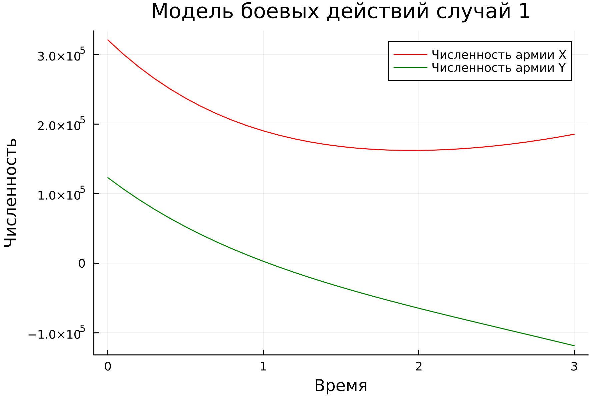
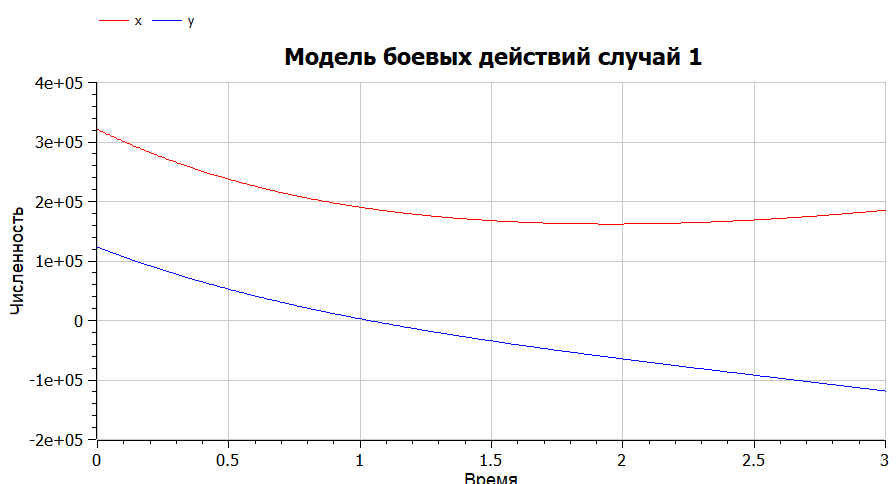
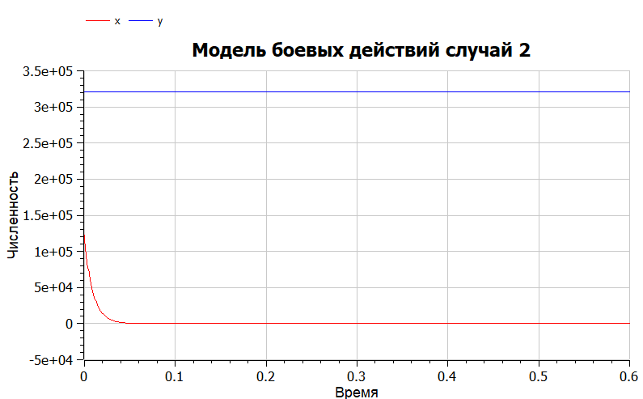

---
## Front matter
title: "Отчёт по лабораторной работе №3


Математическое моделирование"
subtitle: "Модель боевых действий. Вариант 53"
author: " Чванова Ангелина Дмитриевна, НПИбд-02-21"

## Generic otions
lang: ru-RU
toc-title: "Содержание"

## Bibliography
bibliography: bib/cite.bib
csl: pandoc/csl/gost-r-7-0-5-2008-numeric.csl

## Pdf output format
toc: true # Table of contents
toc-depth: 2
lof: true # List of figures
fontsize: 12pt
linestretch: 1.5
papersize: a4
documentclass: scrreprt
## I18n polyglossia
polyglossia-lang:
  name: russian
  options:
	- spelling=modern
	- babelshorthands=true
polyglossia-otherlangs:
  name: english
## I18n babel
babel-lang: russian
babel-otherlangs: english
## Fonts
mainfont: PT Serif
romanfont: PT Serif
sansfont: PT Sans
monofont: PT Mono
mainfontoptions: Ligatures=TeX
romanfontoptions: Ligatures=TeX
sansfontoptions: Ligatures=TeX,Scale=MatchLowercase
monofontoptions: Scale=MatchLowercase,Scale=0.9
## Biblatex
biblatex: true
biblio-style: "gost-numeric"
biblatexoptions:
  - parentracker=true
  - backend=biber
  - hyperref=auto
  - language=auto
  - autolang=other*
  - citestyle=gost-numeric
## Pandoc-crossref LaTeX customization
figureTitle: "Рис."
tableTitle: "Таблица"
listingTitle: "Листинг"
lofTitle: "Список иллюстраций"
lolTitle: "Листинги"
## Misc options
indent: true
header-includes:
  - \usepackage{indentfirst}
  - \usepackage{float} # keep figures where there are in the text
  - \floatplacement{figure}{H} # keep figures where there are in the text
---

# Цель работы

Решить задачу о модели боевых действий с помощью Julia и OpenModelica.

# Теоретическое введение

Законы Ланчестера (законы Осипова — Ланчестера) — математическая формула для расчета относительных сил пары сражающихся сторон — подразделений вооруженных сил

*Уравнения Ланчестера — это дифференциальные уравнения, описывающие зависимость между силами сражающихся сторон A и D как функцию от времени, причем функция зависит только от A и D.*

В 1916 году, в разгар первой мировой войны, Фредерик Ланчестер разработал систему дифференциальных уравнений для демонстрации соотношения между противостоящими силами. Среди них есть так называемые Линейные законы Ланчестера (первого рода или честного боя, для рукопашного боя или неприцельного огня) и Квадратичные законы Ланчестера (для войн начиная с XX века с применением прицельного огня, дальнобойных орудий, огнестрельного оружия) [4].

Рассмотривается три случая ведения боевых действий:

1. Боевые действия между регулярными войсками

2. Боевые действия с участием регулярных войск и партизанских отрядов

3. Боевые действия между партизанскими отрядами

# Задание

Между страной Х и страной У идет война. Численность состава войск исчисляется от начала войны, и являются временными функциями $x(t)$ и $y(t)$. В
начальный момент времени страна Х имеет армию численностью $321 000$ человек, а в распоряжении страны У армия численностью в $123 000$ человек. Для упрощения модели считаем, что коэффициенты $a$, $b$, $c$, $h$ постоянны. Также считаем $P(t)$ и $Q(t)$ непрерывными функциями. 

Постройте графики изменения численности войск армии Х и армии У для следующих случаев:

1. Модель боевых действий между регулярными войсками:

$$ {dx\over {dt}} = -0.336x(t)-0.877(t)+sin(t+1)+1 $$
$$ {dy\over {dt}} = -0.4441x(t)-0.232y(t)+cos(t+2)+1 $$

2. Модель ведение боевых действий с участием регулярных войск и партизанских отрядов:

$$ {dx\over {dt}} = -0.432x(t)-0.815y(t)+sin(2t) +2 $$
$$ {dy\over {dt}} = -0.336x(t)y(t)-0.245y(t)+cos(t) + 2 $$

# Задачи

1. Построить модель боевых действий между регулярными войсками на языках Julia и OpenModelica
2. Построить модель ведения боевых действий с участием регулярных войск и
партизанских отрядов на языках Julia и OpenModelica

# Выполнение лабораторной работы

## Математическая модель

### Регулярная армия X против регулярной армии Y

Рассмотрим первый случай. 
Численность регулярных войск определяется тремя факторами:

1. Cкорость уменьшения численности войск из-за причин, не связанных с боевыми действиями (болезни, травмы, дезертирство);
2. Cкорость потерь, обусловленных боевыми действиями противоборствующих сторон (что связанно с качеством стратегии, уровнем вооружения, профессионализмом солдат и т.п.);
3. Cкорость поступления подкрепления (задаётся некоторой функцией от времени).

В этом случае модель боевых действий между регулярными войсками описывается следующим образом:

$$ {dx\over {dt}} = -a(t)x(t)-b(t)y(t)+P(t) $$
$$ {dy\over {dt}} = -c(t)x(t)-h(t)y(t)+Q(t) $$

В первом пункте нами рассматривается как раз такая модель. Она является доработанной моделью Ланчестера, так его изначальная модель учитывала лишь члены $b(t)y(t)$ и $c(t)x(t)$, то есть, на потери за промежуток времени влияли лишь численность армий и "эффективность оружия" (коэффициенты $b(t)$ и $c(t)$).

$$ {dx\over {dt}} = -ax(t)-by(t)+P(t) $$
$$ {dy\over {dt}} = -cx(t)-hy(t)+Q(t) $$

Именно эти уравнения [3] и будут решать наши программы для выполнения первой части задания. В конце мы получим график кривой в декартовых координатах, где по оси $ox$ будет отображаться численность армии государства X, по оси $oy$ будет отображаться соответствующая численность армии Y. По тому, с какой осью пересечётся график, можно определить исход войны. Если ось $ox$ будет пересечена в положительных значениях, победа будет на стороне армии государства X (так как при таком раскладе численность армии Y достигла нуля при положительном значении численности армии X). Аналогичная ситуация для оси $oy$ и победы армии государства Y. 

### Регулярная армия X против партизанской армии Y

Для второй части задания, то есть, для моделирования боевых действий между регулярной армией и партизанской армией, необходимо внести поправки в предыдущую модель. Считается, что темп потерь партизан, проводящих свои операции в разных местах на некоторой известной территории, пропорционален не только численности армейских соединений, но и численности самих партизан.

$$ {dx\over {dt}} = -a(t)x(t)-b(t)y(t)+P(t) $$
$$ {dy\over {dt}} = -c(t)x(t)y(t)-h(t)y(t)+Q(t) $$

Коэффициенты $a$, $b$, $c$ и $h$ всё так же будут положительными десятичными числами:

$$ {dx\over {dt}} = -ax(t)-by(t)+P(t) $$
$$ {dy\over {dt}} = -cx(t)y(t)-hy(t)+Q(t) $$


## Решение с помощью программ

### Julia

#### Программный код решения на Julia 

Код программы [1]:

```
using Plots
using DifferentialEquations

function model1(du, u, p, t)
	du[1]= -0.336*u[1] - 0.877*u[2] + sin(t+1) + 1
	du[2]= -0.441*u[1] - 0.232*u[2] + cos(t+2) + 1

end

function model2(du, u, p, t)
	du[1]= -0.432*u[1] - 0.815*u[2] + sin(2*t) + 2
	du[2]= -0.336*u[1]*u[2] - 0.245*u[2] + cos(t) + 2

end

const mans = Float64[321000, 123000]
const prom1 = [0.0, 3.0]
const prom2 = [0.0, 0.0007]

prob1 = ODEProblem(model1, mans, prom1)
prob2 = ODEProblem(model2, mans, prom2)

sol1 = solve(prob1, dtmax=0.1)
sol2 = solve(prob2, dtmax=0.000001)

A1= [u[1] for u in sol1.u]
A2= [u[2] for u in sol1.u]

A3= [u[1] for u in sol2.u]
A4= [u[2] for u in sol2.u]

T1= [t for t in sol1.t]
T2= [t for t in sol2.t]

plt1 = plot(dpi = 300, legend = true, bg =:white)
plot!(plt1, xlabel="Время", ylabel="Численность", title="Модель боевых действий случай 1")
plot!(plt1, T1, A1, label="Численность армии X", color =:red)
plot!(plt1, T1, A2, label="Численность армии Y", color =:green)
savefig(plt1, "lab3_1.png")

plt2 = plot(dpi = 1200, legend = true, bg =:white)
plot!(plt2, xlabel="Время", ylabel="Численность", title="Модель боевых действий случай 2")
plot!(plt2, T2, A3, label="Численность армии X", color =:red)
plot!(plt2, T2, A4, label="Численность армии Y", color =:green)
savefig(plt2, "lab3_2.png")
```

Скомпилируем файл командной в PShell:

{#fig:001}

### Результаты работы кода на Julia

На рис.2-3 изображены итоговые графики для обоих случаев.

{#fig:002}

{#fig:003}

### Программный код решения на OpenModelica 
[2]
```
model Lab03_01
Real x;
Real y;
Real a = 0.336;
Real b = 0.877;
Real c = 0.441;
Real d = 0.232;
Real t = time;
initial equation
x = 321000;
y = 123000;
equation
der(x) = -a*x - b*y + sin(t+1)+1;
der(y) = -c*x - d*y + cos(t+2)+1;
end Lab03_01;

```

```
model Lab03_02
Real x;
Real y;
Real a = 0.432;
Real b = 0.815;
Real c = 0.336;
Real d = 0.245;
Real t = time;
initial equation
x = 123000;
y = 321000;
equation
der(y) = -a*x - b*y + sin(2*t)+2;
der(x) = -c*x*y - d*y + cos(t)+2;
end Lab03_02;

```

### Результаты работы кода на OpenModelica

На графиках на рис.4-5, построенных с помощью OpenModelica изображены графики, аналогичные графикам рис.2-3 соответственно.

{#fig:004}

{#fig:005}

# Анализ полученных результатов. Сравнение языков.

Из полученных графиков можно сделать вывод, что для первой модели, то есть двух регулярных армий, противостоящих друг другу, графики на Julia и OpenModelica идентичны (с поправкой на использование разных графических ресурсов, разный масштаб и т.д.).

Также графики противостояния регулярной армии армии партизанов, которые рассматривались во второй модели, схожи для Julia и OpenModelica.

# Вывод

В ходе лабораторной работы были построены по две модели на языках Julia и OpenModelica. OpenModelica лучше приспособлена для моделирование процессов, протекающих во времени. Построение моделей боевых действий на языке OpenModelica занимает гораздо меньше строк и времени, чем аналогичное построение на языке Julia.

# Список литературы. Библиография

[1] Документация по Julia: https://docs.julialang.org/en/v1/

[2] Документация по OpenModelica: https://openmodelica.org/

[3] Решение дифференциальных уравнений: https://www.wolframalpha.com/

[4] Законы Ланчестера: https://ru.wikipedia.org/wiki/%D0%97%D0%B0%D0%BA%D0%BE%D0%BD%D1%8B_%D0%9E%D1%81%D0%B8%D0%BF%D0%BE%D0%B2%D0%B0_%E2%80%94_%D0%9B%D0%B0%D0%BD%D1%87%D0%B5%D1%81%D1%82%D0%B5%D1%80%D0%B0