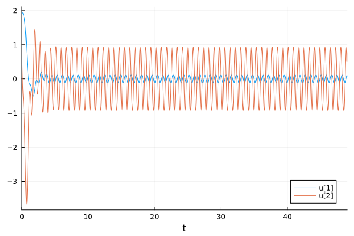

---
## Front matter
lang: ru-RU
title: Лабораторная работа №4
subtitle: Модель гармонических колебаний. Вариант №53
author:
  - Чванова Ангелина Дмитриевна
institute:
  - Российский университет дружбы народов, Москва, Россия
date: 1 марта 2024

babel-lang: russian
babel-otherlangs: english
mainfont: Arial
monofont: Courier New
fontsize: 12pt

## Formatting pdf
toc: false
toc-title: Содержание
slide_level: 2
aspectratio: 169
section-titles: true
theme: metropolis
header-includes:
 - \metroset{progressbar=frametitle,sectionpage=progressbar,numbering=fraction}
 - '\makeatletter'
 - '\beamer@ignorenonframefalse'
 - '\makeatother'
---

# Информация

## Докладчик

:::::::::::::: {.columns align=center}
::: {.column width="70%"}

  * Чванова Ангелина Дмитриевна
  * студент
  * Российский университет дружбы народов
  * [angelinachdm@gmail.com](mailto:angelinachdm@gmail.com)
  * <https://adchvanova-new.github.io/ru/>

:::
::: {.column width="30%"}


:::
::::::::::::::

# Цель работы

Изучить понятие гармонического осциллятора, построить фазовый портрет и решить уравнения гармонического осциллятора.


## Задачи

1. Построить решение уравнения гармонического осциллятора без затухания 
2. Записать уравнение свободных колебаний гармонического осциллятора с затуханием, построить его решение. Построить фазовый портрет гармонических колебаний с затуханием.
3. Записать уравнение колебаний гармонического осциллятора, если на систему действует внешняя сила, построить его решение. Построить фазовый портрет колебаний с действием внешней силы


# Задание

Вариант 53:

Постройте фазовый портрет гармонического осциллятора и решение уравнения гармонического осциллятора для следующих случаев:

1. Колебания гармонического осциллятора без затуханий и без действий внешней силы $\ddot{x}+1.9x=0$;
2. Колебания гармонического осциллятора c затуханием и без действий внешней силы $\ddot{x}+2.9\dot{x}+3.9x=0$
3. Колебания гармонического осциллятора c затуханием и под действием внешней силы $\ddot{x}+4.9\dot{x}+5.9x=6.9sin(7.9t)$

На интервале $t\in [0;49]$ (шаг $0.05$) с начальными условиями $x_0=1.9, y_0=0.9$.

# Выполнение лабораторной работы

## Построение математической модели. Решение с помощью программ

Код программы для первого случая:

```
#case № 1
# x'' + 1.9x = 0
using DifferentialEquations

function func1!(du, u, p, t)
	a=p
	du[1]=u[2]
	du[2]=-a*u[1]
end
```

# Выполнение лабораторной работы

## Построение математической модели. Решение с помощью программ

```
const x = 1.9
const y = 0.9
u0= [x,y]
p=(1.9)
```


# Выполнение лабораторной работы

## Построение математической модели. Решение с помощью программ

```
interval =(0.0, 49.0)
problem1= ODEProblem(func1!, u0, interval, p)
solution= solve(problem1,dtmax=0.05)
using Plots; gr()

plot(solution)
savefig("lab4_case1_julia.png")

plot(solution, vars=(2,1))
savefig("lab4_case1_phase_julia.png")

```

# Результаты работы кода на Julia

Первый случай: 

Колебания гармонического осциллятора без затуханий и без действий внешней силы

{#fig:001 width=40%}

# Результаты работы кода на Julia

{#fig:002 width=40%} 

# Результаты работы кода на Julia

Второй случай:

Колебания гармонического осциллятора c затуханием и без действий внешней силы

{#fig:003 width=40%}

# Результаты работы кода на Julia

{#fig:004 width=40%}

# Результаты работы кода на Julia

Третий случай:

Колебания гармонического осциллятора c затуханием и под действием внешней силы

{#fig:005 width=40%}

# Результаты работы кода на Julia

{#fig:006 width=40%}


# Результаты работы кода на OpenModelica

Первый случай: 

Колебания гармонического осциллятора без затуханий и без действий внешней силы

{#fig:007 width=40%}

# Результаты работы кода на OpenModelica

{#fig:008 width=40%}

# Результаты работы кода на OpenModelica

Второй случай:

Колебания гармонического осциллятора c затуханием и без действий внешней силы

{#fig:009 width=40%}

# Результаты работы кода на OpenModelica

{#fig:010 width=40%}

# Результаты работы кода на OpenModelica

Третий случай:

Колебания гармонического осциллятора c затуханием и под действием внешней силы

{#fig:011 width=40%}

# Результаты работы кода на OpenModelica

{#fig:012 width=40%}


# Анализ полученных результатов. Сравнение языков.

В итоге проделанной работы нами были построены три модели на языках Julia и OpenModelica. Можно отметить, что построение моделей колебания на языке OpenModelica занимает меньше строк, чем аналогичное построение на Julia.

# Вывод

В ходе выполнения лабораторной работы были построены решения уравнения гармонического осциллятора и фазовые портреты гармонических колебаний без затухания, с затуханием и при действии внешней силы на языках Julia и Open Modelica.

# Список литературы. Библиография

[1] Документация по Julia: https://docs.julialang.org/en/v1/

[2] Документация по OpenModelica: https://openmodelica.org/

[3] Бутиков И. Е. Собственные колебания линейного осциллятора. 2011.