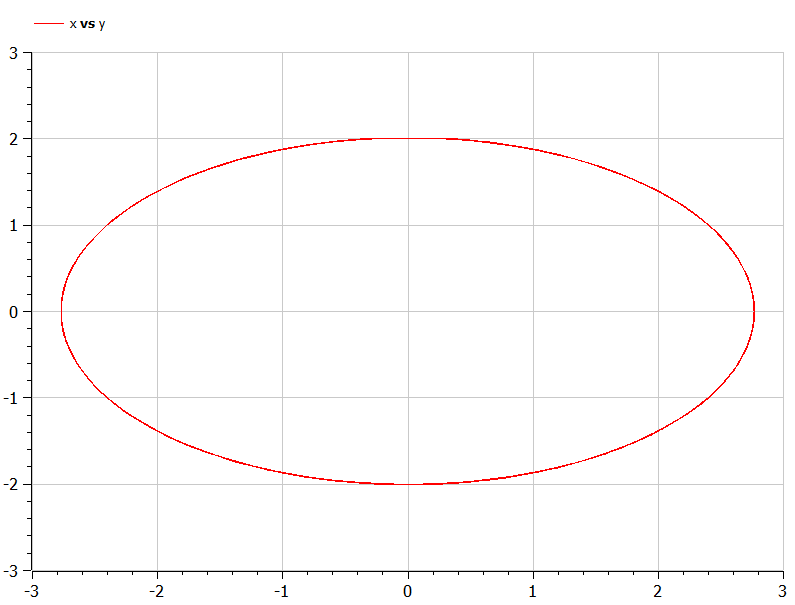

---
## Front matter
title: "Отчёт по лабораторной работе №4"
subtitle: "Модель гармонических колебаний. Вариант №53"
author: "Чванова Ангелина Дмитриевна, НПИбд-02-21"


## Generic otions
lang: ru-RU
toc-title: "Содержание"

## Bibliography
bibliography: bib/cite.bib
csl: pandoc/csl/gost-r-7-0-5-2008-numeric.csl

## Pdf output format
toc: true # Table of contents
toc-depth: 2
lof: true # List of figures
fontsize: 12pt
linestretch: 1.5
papersize: a4
documentclass: scrreprt
## I18n polyglossia
polyglossia-lang:
  name: russian
  options:
	- spelling=modern
	- babelshorthands=true
polyglossia-otherlangs:
  name: english
## I18n babel
babel-lang: russian
babel-otherlangs: english
## Fonts
mainfont: PT Serif
romanfont: PT Serif
sansfont: PT Sans
monofont: PT Mono
mainfontoptions: Ligatures=TeX
romanfontoptions: Ligatures=TeX
sansfontoptions: Ligatures=TeX,Scale=MatchLowercase
monofontoptions: Scale=MatchLowercase,Scale=0.9
## Biblatex
biblatex: true
biblio-style: "gost-numeric"
biblatexoptions:
  - parentracker=true
  - backend=biber
  - hyperref=auto
  - language=auto
  - autolang=other*
  - citestyle=gost-numeric
## Pandoc-crossref LaTeX customization
figureTitle: "Рис."
tableTitle: "Таблица"
listingTitle: "Листинг"
lofTitle: "Список иллюстраций"
lolTitle: "Листинги"
## Misc options
indent: true
header-includes:
  - \usepackage{indentfirst}
  - \usepackage{float} # keep figures where there are in the text
  - \floatplacement{figure}{H} # keep figures where there are in the text
---

# Цель работы

Изучить понятие гармонического осциллятора, построить фазовый портрет и решить уравнения гармонического осциллятора.


# Задачи

1. Построить решение уравнения гармонического осциллятора без затухания 
2. Записать уравнение свободных колебаний гармонического осциллятора с 
затуханием, построить его решение. Построить фазовый портрет гармонических 
колебаний с затуханием.
3. Записать уравнение колебаний гармонического осциллятора, если на систему действует внешняя сила, построить его решение. Построить фазовый портрет колебаний с действием внешней силы

# Теоретическое введение

- Гармонический осциллятор [1] — система, при смещении которой из положения равновесия испытывает действие возвращающей силы F, пропорциональной смещению x.

- Гармоническое колебание [2] - колебание, в процессе которого величины,которые характеризуют смещение, скорость, ускорение и др., изменяются по гармоническому закону (закону синуса или косинуса).

Движение грузика на пружинке, маятника, заряда в электрическом контуре, а также эволюция во времени многих систем в физике, химии, биологии и других науках при определенных предположениях можно описать одним и тем же дифференциальным уравнением, которое в теории колебаний выступает в качестве основной модели. Эта модель называется линейным гармоническим осциллятором.
Уравнение свободных колебаний гармонического осциллятора имеет следующий вид:
$$\ddot{x}+2\gamma\dot{x}+\omega_0^2=0$$

где $x$ - переменная, описывающая состояние системы (смещение грузика, заряд конденсатора и т.д.), $\gamma$ - параметр, характеризующий потери энергии (трение в механической системе, сопротивление в контуре), $\omega_0$ - собственная частота колебаний.
Это уравнение есть линейное однородное дифференциальное  уравнение второго порядка и оно является примером линейной динамической системы.

При отсутствии потерь в системе ( $\gamma=0$ ) получаем уравнение консервативного осциллятора энергия колебания которого сохраняется во времени.
$$\ddot{x}+\omega_0^2x=0$$

Для однозначной разрешимости уравнения второго порядка необходимо задать два начальных условия вида
 
$$
 \begin{cases}
	x(t_0)=x_0
	\\   
	\dot{x(t_0)}=y_0
 \end{cases}
$$

Уравнение второго порядка можно представить в виде системы двух уравнений первого порядка:
$$
 \begin{cases}
	x=y
	\\   
	y=-\omega_0^2x
 \end{cases}
$$

Начальные условия для системы примут вид:
$$
 \begin{cases}
	x(t_0)=x_0
	\\   
	y(t_0)=y_0
 \end{cases}
$$

Независимые	переменные	$x, y$	определяют	пространство,	в	котором «движется» решение. Это фазовое пространство системы, поскольку оно двумерно будем называть его фазовой плоскостью.

Значение фазовых координат $x, y$ в любой момент времени полностью определяет состояние системы. Решению уравнения движения как функции времени отвечает гладкая кривая в фазовой плоскости. Она называется фазовой траекторией. Если множество различных решений (соответствующих различным 
начальным условиям) изобразить на одной фазовой плоскости, возникает общая картина поведения системы. Такую картину, образованную набором фазовых траекторий, называют фазовым портретом.

# Задание

Вариант 53:

Постройте фазовый портрет гармонического осциллятора и решение уравнения гармонического осциллятора для следующих случаев:

1. Колебания гармонического осциллятора без затуханий и без действий внешней силы $\ddot{x}+4.3x=0$;
2. Колебания гармонического осциллятора c затуханием и без действий внешней силы $\ddot{x}+\dot{x}+20x=0$
3. Колебания гармонического осциллятора c затуханием и под действием внешней силы $\ddot{x}+\dot{x}+8.8x=0.7sin(3t)$

На интервале $t\in [0;61]$ (шаг $0.05$) с начальными условиями $x_0=-0.3, y_0=1.3$.

# Выполнение лабораторной работы

## Построение математической модели. Решение с помощью программ

### Julia

Код программы для первого случая:

```
#case № 1
# x'' + 1.9x = 0
using DifferentialEquations

function func1!(du, u, p, t)
	a=p
	du[1]=u[2]
	du[2]=-a*u[1]
end
const x = 1.9
const y = 0.9
u0= [x,y]
p=(1.9)
interval =(0.0, 49.0)
problem1= ODEProblem(func1!, u0, interval, p)
solution= solve(problem1,dtmax=0.05)
using Plots; gr()

plot(solution)
savefig("lab4_case1_julia.png")

plot(solution, vars=(2,1))
savefig("lab4_case1_phase_julia.png")

```
Код программы для второго случая:

```
#case 2
# x'' + 2.9x' + 3.9x = 0
using DifferentialEquations

function func2!(du, u, p, t)
    a, b = p
    du[1] = u[2]
    du[2] = -a*du[1] - b*u[1] 
end

const x = 1.9
const y = 0.9
u0 = [x, y]

p = (sqrt(2.9), 3.9)
interval = (0.0, 49.0)
problem2= ODEProblem(func2!, u0, interval, p)
solution= solve(problem2,dtmax=0.05)

using Plots; gr()

plot(solution)
savefig("lab4_case2_julia.png")

plot(solution, vars=(2,1))
savefig("lab4_case2_phase_julia.png")
```

Код программы для третьего случая:

```
#case 3
# x'' + 4.9x' + 5.9x = 6.9sin(7.9t)
using DifferentialEquations

function func3!(du, u, p, t)
    a, b = p
    du[1] = u[2]
    du[2] = -a*du[1] - b*u[1] + 6.9*sin(7.9*t)
end

const x = 1.9
const y = 0.9
u0 = [x, y]

p = (sqrt(4.9), 5.9)
interval = (0.0, 49.0)
problem3= ODEProblem(func3!, u0, interval, p)
solution= solve(problem3,dtmax=0.05)

using Plots; gr()

plot(solution)
savefig("lab4_case3_julia.png")

plot(solution, vars=(2,1))
savefig("lab4_case3_phase_julia.png")
```

### Результаты работы кода на Julia

Первый случай: 

Колебания гармонического осциллятора без затуханий и без действий внешней силы

{#fig:001}

{#fig:002}

Второй случай:

Колебания гармонического осциллятора c затуханием и без действий внешней силы

{#fig:003}

{#fig:004}

Третий случай:

Колебания гармонического осциллятора c затуханием и под действием внешней силы

{#fig:005}

{#fig:006}

## OpenModelica

Код программы для первого случая:

```
//case1: x''+ 1.9x = 0
model lab4_1 
//x'' + g* x' + w^2* x = f(t) 
//w - частота 
//g - затухание 

parameter Real w = 1.9;
parameter Real g = 0;
parameter Real x0 = 1.9;// начальное условие
parameter Real y0 = 0.9;// начальное условие
Real x(start=x0);
Real y(start=y0);
equation
der(x)=y;
der(y)=-w*x;

end lab4_1;

```

Код программы для второго случая:

```
//case2: x'' + 2.9x' + 3.9x = 0
model lab4_2

parameter Real w = sqrt(3.90);  
parameter Real g = 2.9;  

parameter Real x0 = 1.9;// начальное условие
parameter Real y0 = 0.9;// начальное условие

Real x(start=x0); 
Real y(start=y0); 

// f(t) 
function f 
input Real t ; 
output Real res; 
algorithm  
res := 0; 
end f; 

equation 
der(x) = y; 
der(y) = -w*w*x - g*y + f(time); 

end lab4_2;

```

Код программы для третьего случая:

```
//case3: x'' + 4.9x' + 5.9x = 6.9sin(7.9t)
model lab4_3

parameter Real w = sqrt(5.90);  
parameter Real g = 2.45;  

parameter Real x0 = 1.9;// начальное условие
parameter Real y0 = 0.9;// начальное условие

Real x(start=x0); 
Real y(start=y0); 

// f(t) 
function f 
input Real t ; 
output Real res; 
algorithm  
res := 6.9*sin(7.9*t); // 3 случай 
end f; 

equation 
der(x) = y; 
der(y) = -w*w*x - g*y - f(time); 
end lab4_3;


```

### Результаты работы кода на OpenModelica

Первый случай: 

Колебания гармонического осциллятора без затуханий и без действий внешней силы

{#fig:007}

{#fig:008}


Второй случай:

Колебания гармонического осциллятора c затуханием и без действий внешней силы

{#fig:009}

{#fig:010}


Третий случай:

Колебания гармонического осциллятора c затуханием и под действием внешней силы

{#fig:011}

{#fig:008}


# Анализ полученных результатов. Сравнение языков.

В итоге проделанной работы нами были построены три модели на языках Julia и OpenModelica. Можно отметить, что построение моделей колебания на языке OpenModelica занимает меньше строк, чем аналогичное построение на Julia.

# Вывод

В ходе выполнения лабораторной работы были построены решения уравнения гармонического осциллятора и фазовые портреты гармонических колебаний без затухания, с затуханием и при действии внешней силы на языках Julia и Open Modelica.

# Список литературы. Библиография

[1] Документация по Julia: https://docs.julialang.org/en/v1/

[2] Документация по OpenModelica: https://openmodelica.org/

[3] Бутиков И. Е. Собственные колебания линейного осциллятора. 2011.