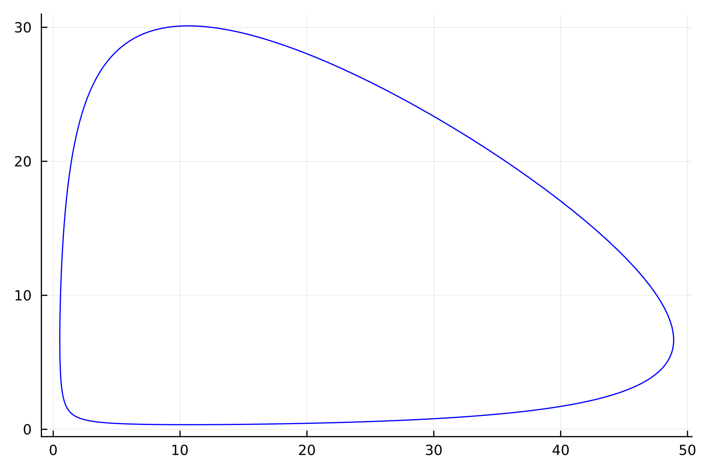
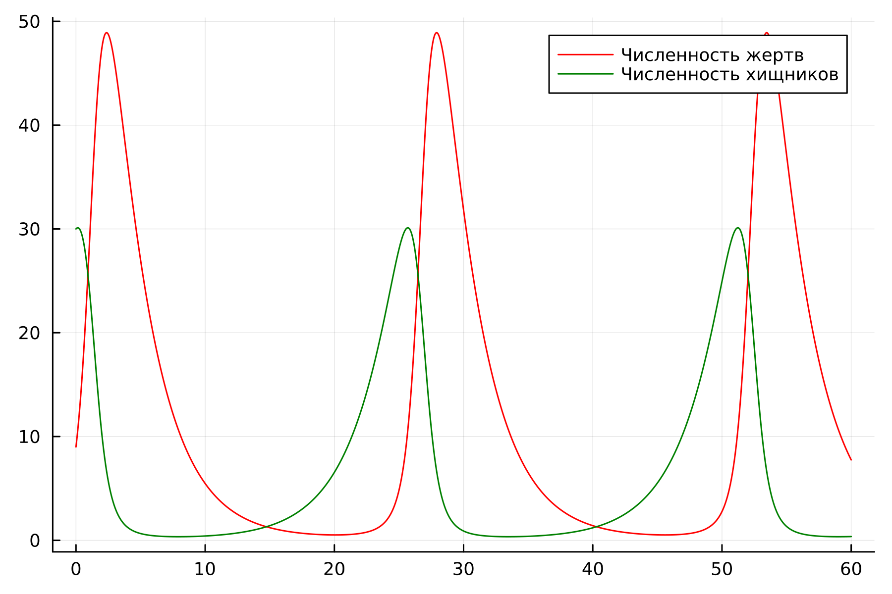
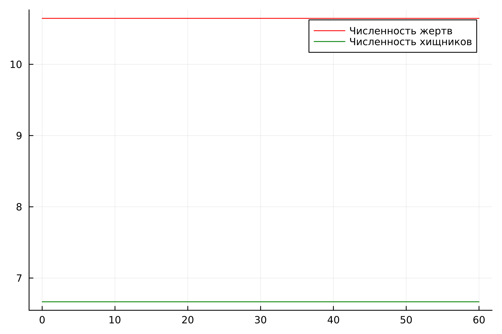
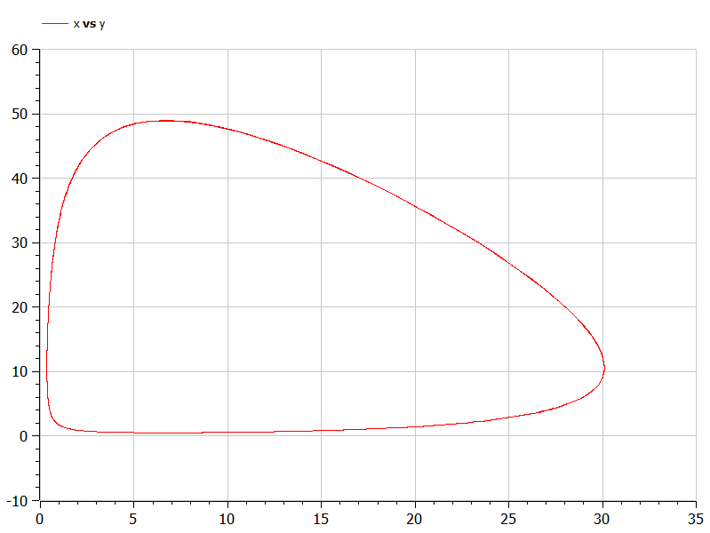
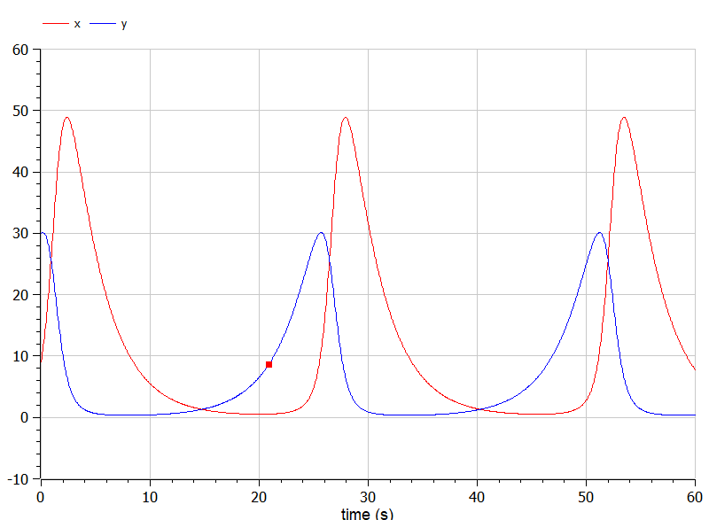
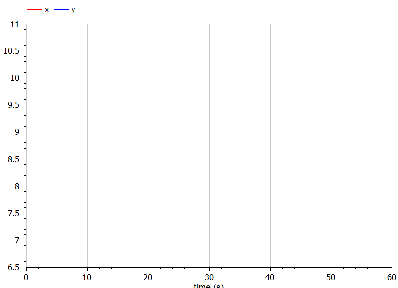

---
## Front matter
lang: ru-RU
title: Лабораторная работа №5
subtitle: Модель хищник-жертва. Вариант №53
author:
  - Чванова Ангелина Дмитриевна
institute:
  - Российский университет дружбы народов, Москва, Россия
date: 4 марта 2024

babel-lang: russian
babel-otherlangs: english
mainfont: Arial
monofont: Courier New
fontsize: 12pt

## Formatting pdf
toc: false
toc-title: Содержание
slide_level: 2
aspectratio: 169
section-titles: true
theme: metropolis
header-includes:
 - \metroset{progressbar=frametitle,sectionpage=progressbar,numbering=fraction}
 - '\makeatletter'
 - '\beamer@ignorenonframefalse'
 - '\makeatother'
---

# Информация

## Докладчик

:::::::::::::: {.columns align=center}
::: {.column width="70%"}

  * Чванова Ангелина Дмитриевна
  * студент
  * Российский университет дружбы народов
  * [angelinachdm@gmail.com](mailto:angelinachdm@gmail.com)
  * <https://adchvanova-new.github.io/ru/>

:::
::: {.column width="30%"}


:::
::::::::::::::

# Цель работы

Решить задачу о модели хищник-жертва.

# Задачи

1. Построить график зависимости численности хищников от численности жертв
2. Построить графики изменения численности хищников и численности жертв при заданных начальных условиях. 
3. Найти стационарное состояние системы.

# Теоретическое введение

Простейшая модель взаимодействия двух видов типа «хищник — жертва» - модель Лотки-Вольтерры. 

{
  $dx/dt = ax(t) -bx(t)y(t)$

  $dy/dt = -cy(t) - dx(t)y(t)$
}

В этой модели x – число жертв, y - число хищников. Коэффициент a описывает скорость естественного прироста числа жертв в отсутствие хищников, с - естественное вымирание хищников, лишенных пищи в виде жертв.

# Выполнение лабораторной работы

## Вариант 53

Для модели «хищник-жертва»:

{
  $dx/dt = -0.34(t) + 0.051x(t)y(t)$

  $dy/dt = 0.33(t) - 0.031x(t)y(t)$
}

Постройте график зависимости численности хищников от численности жертв, а также графики изменения численности хищников и численности жертв при следующих начальных условиях: $x_0 = 9$, $y_0=30$. Найдите стационарное
состояние системы.

# Выполнение лабораторной работы
## Julia

{#fig:001 width=55%}

# Выполнение лабораторной работы
## Julia

{#fig:002 width=55%}

# Выполнение лабораторной работы
## Julia

Для стацианарного состояния системы:

{#fig:002 width=55%}

# Выполнение лабораторной работы
## OpenModelica

Код для нестацианарного состояния системы:
```
model lab05_1
Real a = 0.34;
Real b = 0.051;
Real c = 0.33;
Real d = 0.031;
Real x;
Real y;
```
# Выполнение лабораторной работы
## OpenModelica

```
initial equation
x = 9;
y = 30;
equation
der(x) = -a*x + b*x*y;
der(y) = c*y - d*x*y;
end lab05_1;

```

# Выполнение лабораторной работы
## OpenModelica


{#fig:004 width=55%}


# Выполнение лабораторной работы
## OpenModelica

{#fig:005 width=55%}

# Выполнение лабораторной работы
## OpenModelica

Для стацианарного состояния системы:

{#fig:006 width=55%}

# Анализ и сравнение результатов

В ходе выполнения лабораторной работы нами были построены графики зависимости численности хищников от численности жертв, а также изменения численности хищников и численности жертв при заданных начальных условиях. Было найдено стационарное состояние системы с помощью Julia и Open Modelica. 

# Выводы

Нами была решена задача о модели Хищник-Жертва и построены графики зависимости численности хищников от численности жертв, изменения численности хищников и численности жертв при заданных начальных условиях, а также найдено стационарное состояние системы

# Список литературы

1. Документация по Julia: https://docs.julialang.org/en/v1/

2. Документация по OpenModelica: https://openmodelica.org/

3. Решение дифференциальных уравнений: https://www.wolframalpha.com/

