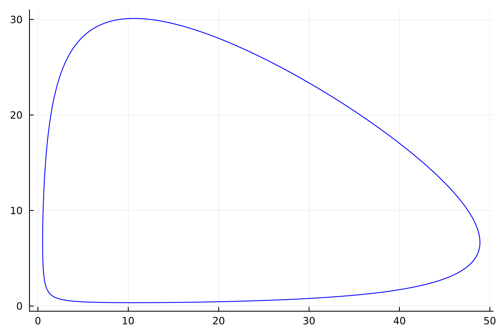
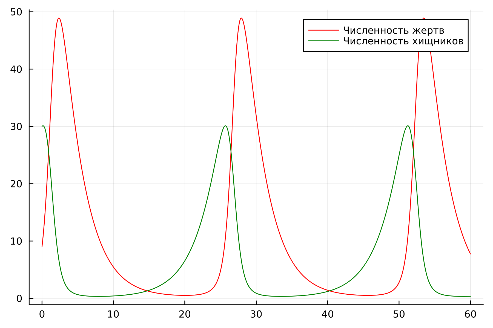
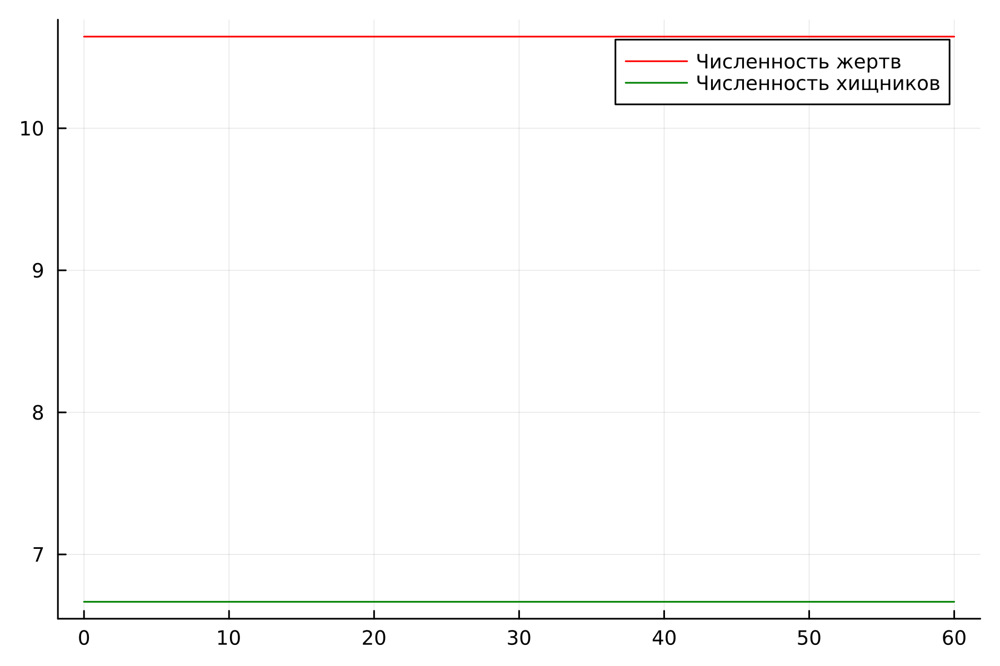
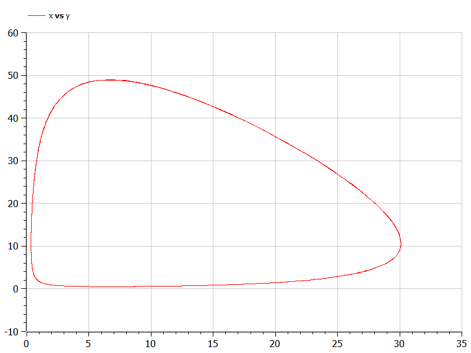
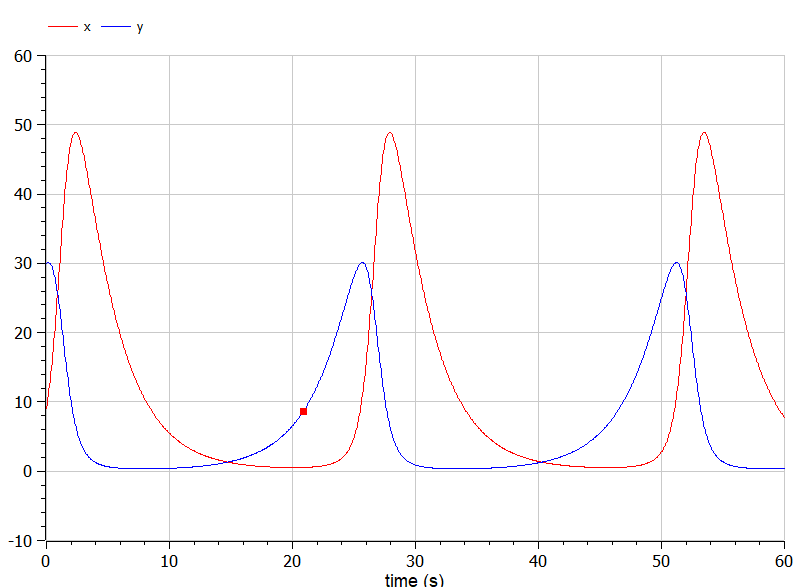
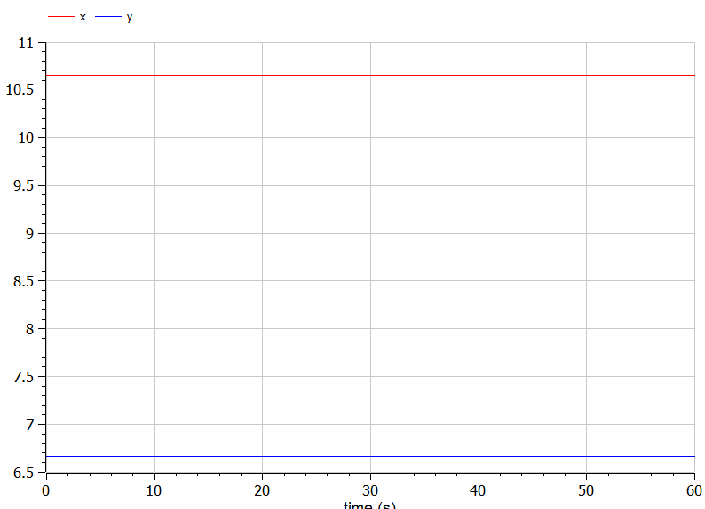

---
## Front matter
title: "Лабораторная работа №5"
subtitle: "Модель хищник-жертва. Вариант 53 "
author: "Чванова Ангелина Дмитриевна, НПИбд-02-21"

## Generic otions
lang: ru-RU
toc-title: "Содержание"

## Bibliography
bibliography: bib/cite.bib
csl: pandoc/csl/gost-r-7-0-5-2008-numeric.csl

## Pdf output format
toc: true # Table of contents
toc-depth: 2
lof: true # List of figures
fontsize: 12pt
linestretch: 1.5
papersize: a4
documentclass: scrreprt
## I18n polyglossia
polyglossia-lang:
  name: russian
  options:
	- spelling=modern
	- babelshorthands=true
polyglossia-otherlangs:
  name: english
## I18n babel
babel-lang: russian
babel-otherlangs: english
## Fonts
mainfont: PT Serif
romanfont: PT Serif
sansfont: PT Sans
monofont: PT Mono
mainfontoptions: Ligatures=TeX
romanfontoptions: Ligatures=TeX
sansfontoptions: Ligatures=TeX,Scale=MatchLowercase
monofontoptions: Scale=MatchLowercase,Scale=0.9
## Biblatex
biblatex: true
biblio-style: "gost-numeric"
biblatexoptions:
  - parentracker=true
  - backend=biber
  - hyperref=auto
  - language=auto
  - autolang=other*
  - citestyle=gost-numeric

## Pandoc-crossref LaTeX customization
figureTitle: "Скриншот"
tableTitle: "Таблица"
listingTitle: "Листинг"
lofTitle: "Список иллюстраций"
lotTitle: "Список таблиц"
lolTitle: "Листинги"
## Misc options
indent: true
header-includes:
  - \usepackage{indentfirst}
  - \usepackage{float} # keep figures where there are in the text
  - \floatplacement{figure}{H} # keep figures where there are in the text
---


# Цель работы

Решить задачу о модели хищник-жертва.

# Задачи

1. Построить график зависимости численности хищников от численности жертв
2. Построить графики изменения численности хищников и численности жертв при заданных начальных условиях. 
3. Найти стационарное состояние системы.

# Теоретическое введение

Простейшая модель взаимодействия двух видов типа «хищник — жертва» - модель Лотки-Вольтерры. Данная двувидовая модель основывается на следующих предположениях:
1. Численность популяции жертв x и хищников y зависят только от времени (модель не учитывает пространственное распределение популяции на занимаемой территории)
2. В отсутствии взаимодействия численность видов изменяется по модели Мальтуса, при этом число жертв увеличивается, а число хищников падает
3. Естественная смертность жертвы и естественная рождаемость хищника считаются несущественными
4. Эффект насыщения численности обеих популяций не учитывается
5. Скорость роста численности жертв уменьшается пропорционально
численности хищников

{
  $dx/dt = ax(t) -bx(t)y(t)$

  $dy/dt = -cy(t) - dx(t)y(t)$
}

В этой модели x – число жертв, y - число хищников. Коэффициент a описывает скорость естественного прироста числа жертв в отсутствие хищников, с - естественное вымирание хищников, лишенных пищи в виде жертв. Вероятность взаимодействия жертвы и хищника считается пропорциональной как количеству жертв, так и числу самих хищников (xy). Каждый акт взаимодействия уменьшает популяцию жертв, но способствует увеличению популяции хищников (члены -bxy и dxy в правой части уравнения). 

# Выполнение лабораторной работы

## Вариант 53

Для модели «хищник-жертва»:

{
  $dx/dt = -0.34(t) + 0.051x(t)y(t)$

  $dy/dt = 0.33(t) - 0.031x(t)y(t)$
}

Постройте график зависимости численности хищников от численности жертв, а также графики изменения численности хищников и численности жертв при следующих начальных условиях: $x_0 = 9$, $y_0=30$. Найдите стационарное
состояние системы.

## Julia

Код для нестацианарного состояния системы:

```
using Plots
using DifferentialEquations

x0=9
y0=30

a=0.34
b=0.051
c=0.33
d=0.031

function func1(du,u,p,t)
	x,y=u
	du[1]=-a*u[1] +b*u[1]*u[2]
	du[2]=c*u[2] -d*u[1]*u[2]
end

v0=[x0,y0]	
interval = (0.0,60.0)
problem=ODEProblem(func1, v0, interval)
solution=solve(problem,dtmax=0.05)

X=[u[1] for u in solution.u]
Y=[u[2] for u in solution.u]
T=[t for t in solution.t]
plt = plot(
  dpi=300,
  legend=false)

plot!(
  plt,
  X,
  Y,
  color=:blue)

savefig(plt, "lab05_1.png")

plt2 = plot(
  dpi=300,
  legend=true)

plot!(
  plt2,
  T,
  X,
  label="Численность жертв",
  color=:red)

plot!(
  plt2,
  T,
  Y,
  label="Численность хищников",
  color=:green)

savefig(plt2, "lab05_2.png")
```

Получим следующие графики (Рис.1-2):

{#fig:001 width=70%}

{#fig:002 width=70%}


Код для стацианарного состояния системы:

```
using Plots
using DifferentialEquations

a=0.34
b=0.051
c=0.33
d=0.031

x0 = c / d 
y0 = a / b 

function func2(du, u, p, t)
    x, y = u
    du[1] = -a*u[1] + b * u[1] * u[2]
    du[2] = c * u[2] - d * u[1] * u[2]
end

v0 = [x0, y0]
interval = (0.0, 60.0)
problem = ODEProblem(func2, v0, interval) 
solution = solve(problem, dtmax=0.05)
X = [u[1] for u in solution.u]
Y = [u[2] for u in solution.u]
T = [t for t in solution.t]

plt2 = plot(
  dpi=300,
  legend=true)

plot!(
  plt2,
  T,
  X,
  label="Численность жертв",
  color=:red)

plot!(
  plt2,
  T,
  Y,
  label="Численность хищников",
  color=:green)

savefig(plt2, "lab05_3.png")
```
Получим следующий график (Рис.3):

{#fig:002 width=70%}


## OpenModelica

Код для нестацианарного состояния системы:
```
model lab05_1
Real a = 0.34;
Real b = 0.051;
Real c = 0.33;
Real d = 0.031;
Real x;
Real y;
initial equation
x = 9;
y = 30;
equation
der(x) = -a*x + b*x*y;
der(y) = c*y - d*x*y;
end lab05_1;

```
Получим следующие графики (Рис.4-5):

{#fig:004 width=70%}

{#fig:005 width=70%}


Код для стацианарного состояния системы:
```
model lab05_2
Real a = 0.34;
Real b = 0.051;
Real c = 0.33;
Real d = 0.031;
Real x;
Real y;
initial equation
x = c / d;
y = a / b;
equation
der(x) = -a*x + b*x*y;
der(y) = c*y - d*x*y;
end lab05_2;

```
Получим следующий график (Рис.6):

{#fig:006 width=70%}

## Анализ и сравнение результатов

В ходе выполнения лабораторной работы нами были построены графики зависимости численности хищников от численности жертв, а также изменения численности хищников и численности жертв при заданных начальных условиях. Было найдено стационарное состояние системы с помощью Julia и Open Modelica. 

# Выводы

Нами была решена задача о модели Хищник-Жертва и построены графики зависимости численности хищников от численности жертв, изменения численности хищников и численности жертв при заданных начальных условиях, а также найдено стационарное состояние системы

# Список литературы

1. Документация по Julia: https://docs.julialang.org/en/v1/

2. Документация по OpenModelica: https://openmodelica.org/

3. Решение дифференциальных уравнений: https://www.wolframalpha.com/

