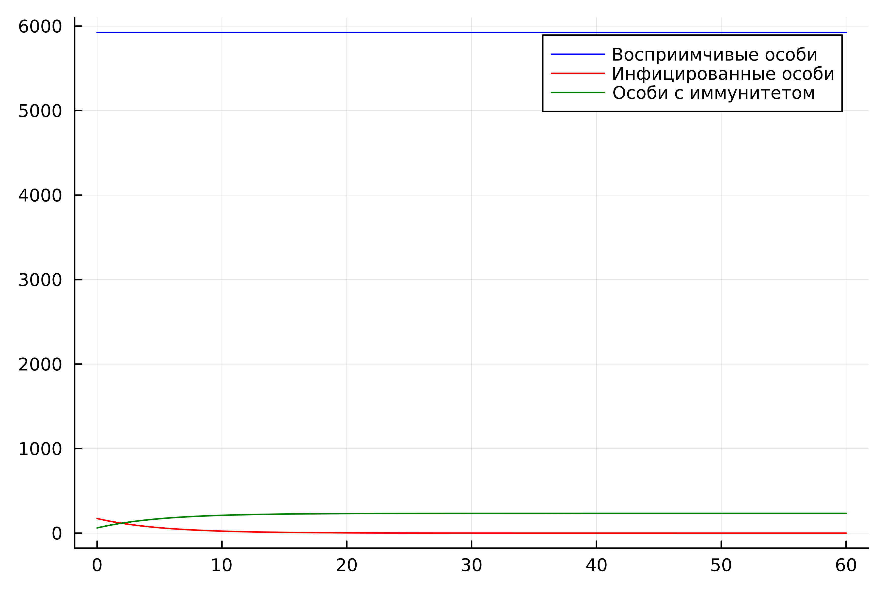
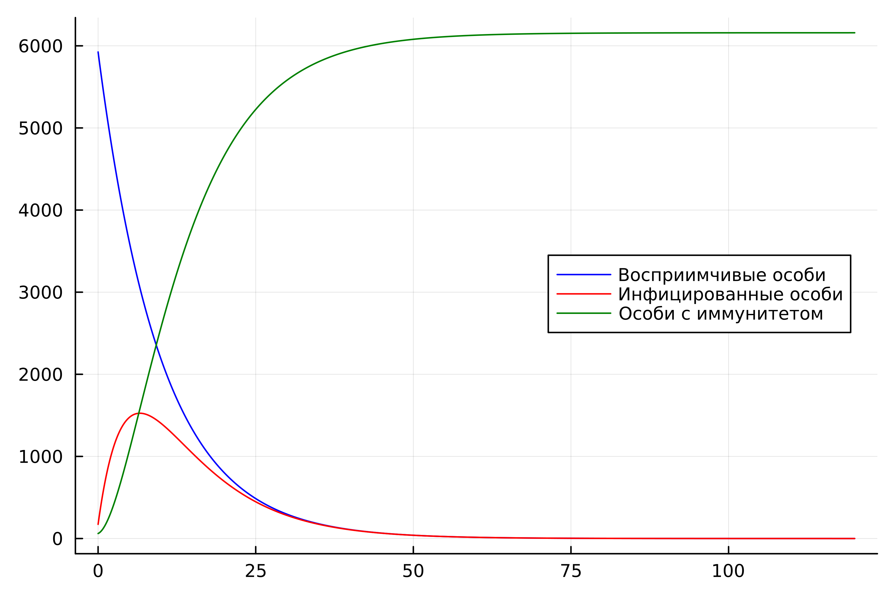
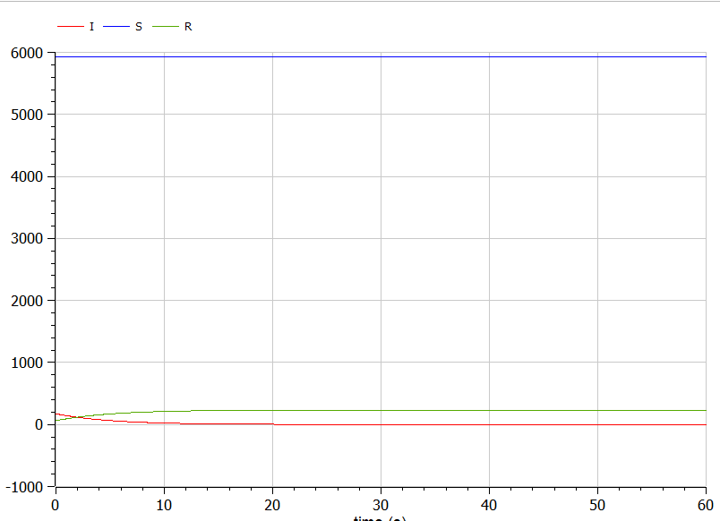
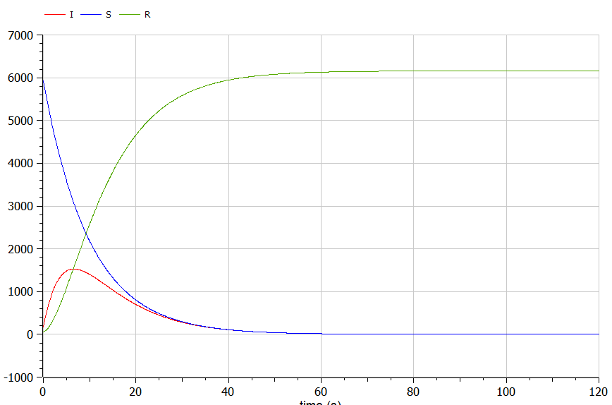

---
## Front matter
lang: ru-RU
title: Лабораторная работа №6
subtitle: Задача об эпидемии. Вариант №53
author:
  - Чванова Ангелина Дмитриевна
institute:
  - Российский университет дружбы народов, Москва, Россия
date: 12 марта 2024

babel-lang: russian
babel-otherlangs: english
mainfont: Arial
monofont: Courier New
fontsize: 10pt

## Formatting pdf
toc: false
toc-title: Содержание
slide_level: 2
aspectratio: 169
section-titles: true
theme: metropolis
header-includes:
 - \metroset{progressbar=frametitle,sectionpage=progressbar,numbering=fraction}
 - '\makeatletter'
 - '\beamer@ignorenonframefalse'
 - '\makeatother'
---

# Информация

## Докладчик

:::::::::::::: {.columns align=center}
::: {.column width="70%"}

  * Чванова Ангелина Дмитриевна
  * студент
  * Российский университет дружбы народов
  * [angelinachdm@gmail.com](mailto:angelinachdm@gmail.com)
  * <https://adchvanova-new.github.io/ru/>

:::
::: {.column width="30%"}


:::
::::::::::::::

# Цель и задачи работы

Цель: Изучить и построить модель эпидемии.

Задачи:
Построить графики изменения числа особей в каждой из трех групп $S$, $I$, $R$. Рассмотреть, как будет протекать эпидемия в случаях:

-	$I(0)\leq I^*$

-	$I(0)>I^*$

# Задание

На одном острове вспыхнула эпидемия. Известно, что из всех проживающих на острове 
$(N=6159)$ в момент начала эпидемии $(t=0)$ число заболевших людей 
(являющихся распространителями инфекции) $I(0)=173$, А число здоровых людей с иммунитетом 
к болезни $R(0)=61$. Таким образом, число людей восприимчивых к болезни, 
но пока здоровых, в начальный момент времени $S(0)=N-I(0)-R(0)$.
Постройте графики изменения числа особей в каждой из трех групп.

Рассмотрите, как будет протекать эпидемия в случае:

1.	$I(0)\leq I^*$

2.	$I(0)>I^*$


# Выполнение лабораторной работы

## Julia

Код программы для случая $I(0) \leq I^*$ (для случая, где больные изолированы):

```
using Plots
using DifferentialEquations

N= 6159
I0=173
R0=61
S0= N - I0 - R0

alpha= 0.1
beta=0.2

# I0<=I*
```
# Выполнение лабораторной работы

```
function func1(du,u,p,t)
	S,I,R=u
	du[1]=0
	du[2]=-beta*u[2]
	du[3]=beta*I
end
```
# Выполнение лабораторной работы

```
v0=[S0,I0,R0]
interval=(0.0,60.0)
problem=ODEProblem(func1,v0,interval)
solution=solve(problem,dtmax=0.05)
S=[u[1] for u in solution.u]
I=[u[2] for u in solution.u]
R=[u[3] for u in solution.u]
T=[t for t in solution.t]
```
# Выполнение лабораторной работы

```
plt = plot(
  dpi = 600,
  legend = :topright)
...

savefig(plt, "lab06_1.png")
```
# Выполнение лабораторной работы

## Результаты работы кода на Julia

{ #fig:001 width=50% height=70% }

# Выполнение лабораторной работы

## Результаты работы кода на Julia

{ #fig:002 width=50% height=70% }

# Выполнение лабораторной работы

## Результаты работы кода на OpenModelica

{ #fig:003 width=50% height=70% }

# Выполнение лабораторной работы

## Результаты работы кода на OpenModelica


{ #fig:004 width=50% height=70% }

# Анализ полученных результатов. Сравнение языков.

В результате проделанной работы нами были построенны графики зависимости численности особей трех групп S, I, R для случаев, когда больные изолированы и когда они могут заражать особей группы S. Графики на OpenModelica и Julia получаются идентичными, что говорит о правильном построении.

# Вывод

В ходе выполнения лабораторной работы нами была изучена модель эпидемии и построена модель на языках Julia и Open Modelica, а также рассмотрены случаи,где больные изолированы и когда они могут заражать особей группы S.

# Список литературы. Библиография.


[1] Документация по Julia: https://docs.julialang.org/en/v1/

[2] Документация по OpenModelica: https://openmodelica.org/

[3] Решение дифференциальных уравнений: https://www.wolframalpha.com/

[4] Конструирование эпидемиологических моделей: https://habr.com/ru/post/551682/