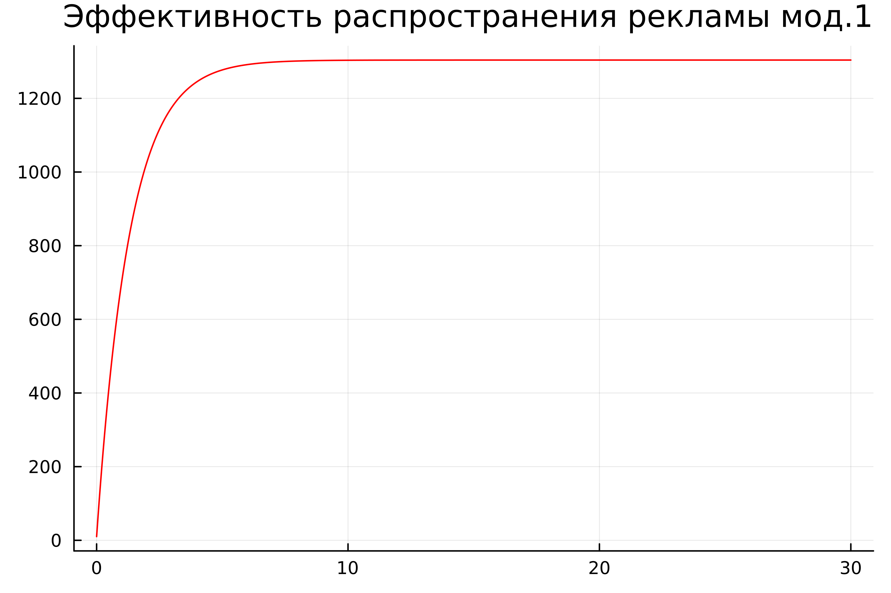
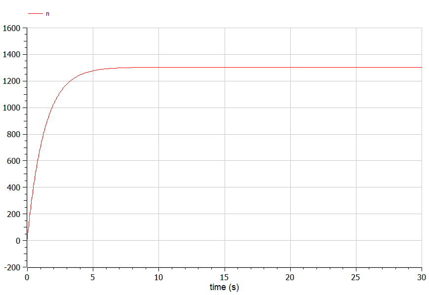
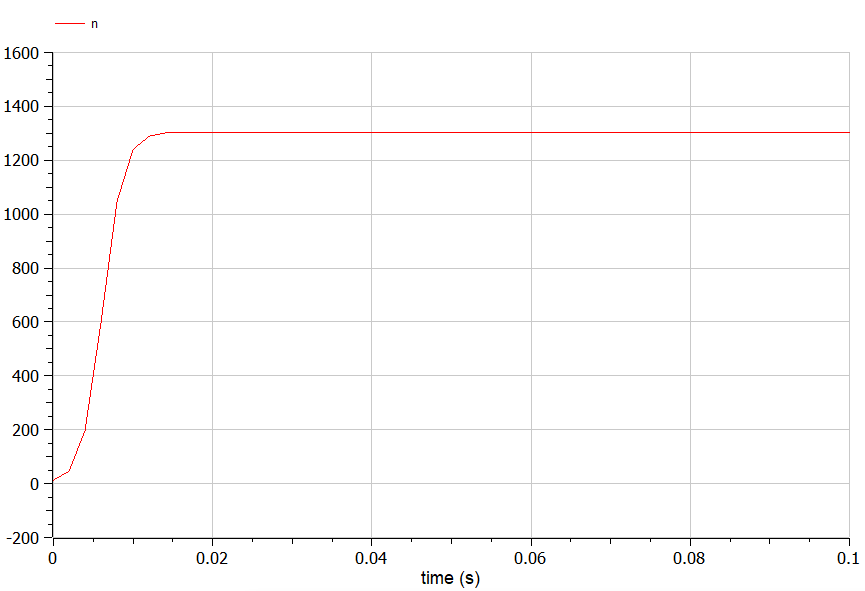

---
## Front matter
lang: ru-RU
title: Лабораторная работа №7
subtitle: Модель распространения рекламы. Вариант №53
author:
  - Чванова Ангелина Дмитриевна
institute:
  - Российский университет дружбы народов, Москва, Россия
date: 19 марта 2024

babel-lang: russian
babel-otherlangs: english
mainfont: Arial
monofont: Courier New
fontsize: 10pt

## Formatting pdf
toc: false
toc-title: Содержание
slide_level: 2
aspectratio: 169
section-titles: true
theme: metropolis
header-includes:
 - \metroset{progressbar=frametitle,sectionpage=progressbar,numbering=fraction}
 - '\makeatletter'
 - '\beamer@ignorenonframefalse'
 - '\makeatother'
---

# Информация

## Докладчик

:::::::::::::: {.columns align=center}
::: {.column width="70%"}

  * Чванова Ангелина Дмитриевна
  * студент
  * Российский университет дружбы народов
  * [angelinachdm@gmail.com](mailto:angelinachdm@gmail.com)
  * <https://adchvanova-new.github.io/ru/>

:::
::: {.column width="30%"}


:::
::::::::::::::

# Цель работы

Изучить и построить модель эффективности рекламы.

# Задание

**Вариант 53**

Постройте график распространения рекламы, математическая модель которой описывается следующим уравнением:

1.	$\frac{dn}{dt} = (0.76 + 0.000016n(t))(N-n(t))$
2.	$\frac{dn}{dt} = (0.000016 + 0.6n(t))(N-n(t))$
3.	$\frac{dn}{dt} = (0.7\sin{(7t)} + 0.7\sin{(3t)}  n(t))(N-n(t))$

При этом объем аудитории $N = 1304$, в начальный момент о товаре знает 10 человек.

Для случая 2 определите в какой момент времени скорость распространения рекламы будет иметь максимальное значение.

# Выполнение лабораторной работы

### Julia

Код программы для первого случая $\frac{dn}{dt} = (0.76 + 0.000016n(t))(N-n(t))$:

```
using Plots
using DifferentialEquations
N=1304
n0=10

function func1(du,u,p,t)
	(n)=u
	du[1]= (0.76 + 0.000016*u[1])*(N-u[1])
end
```

# Выполнение лабораторной работы
### Julia

```

v0=[n0]
interval=(0.0,30.0)
problem=ODEProblem(func1,v0,interval)
solution=solve(problem,dtmax=0.05)
n=[u[1] for u in solution.u]
T=[t for t in solution.t]
```

# Выполнение лабораторной работы
### Julia

```

plt = plot(
  dpi = 600,
  title = "Эффективность распространения рекламы мод.1 ",
  legend = false)
plot!(
  plt,
  T,
  n,
  color = :red) 
savefig(plt, "lab07_1.png")
```

# Результаты работы кода на Julia

{ #fig:003 width=70% height=70% }

# Результаты работы кода на Julia

{ #fig:004 width=70% height=70% }

# Результаты работы кода на Julia

{ #fig:005 width=70% height=70% }

# OpenModelica

Код программы для первого случая $\frac{dn}{dt} = (0.76 + 0.000016n(t))(N-n(t))$:

```
model lab07_1
Real N = 1304;
Real n;
initial equation
n = 10;
equation
der(n) = (0.76 + 0.000016*n)*(N-n);
end lab07_1;

```

# Результаты работы кода на OpenModelica

{ #fig:006 width=70% height=70% }

# Результаты работы кода на OpenModelica

{ #fig:007 width=70% height=70% }

# Результаты работы кода на OpenModelica

{ #fig:008 width=70% height=70% }

# Анализ полученных результатов. Сравнение языков.

В результате проделанной работы нами были построены графики распространения рекламы для трех случаев на Julia и OpenModelica. Построения на языке OpenModelica проводятся относительно значения времени t по умолчанию, что делает работу с построением данных графиков проще. 

# Вывод

В ходе выполнения лабораторной работы была изучена модель эффективности рекламы, а также были построены графики распространения рекламы для трех случаев на Julia и OpenModelica.

# Список литературы. Библиография.

[1] Документация по Julia: https://docs.julialang.org/en/v1/

[2] Документация по OpenModelica: https://openmodelica.org/

[3] Решение дифференциальных уравнений: https://www.wolframalpha.com/

[4] Мальтузианская модель роста: https://www.stolaf.edu//people/mckelvey/envision.dir/malthus.html