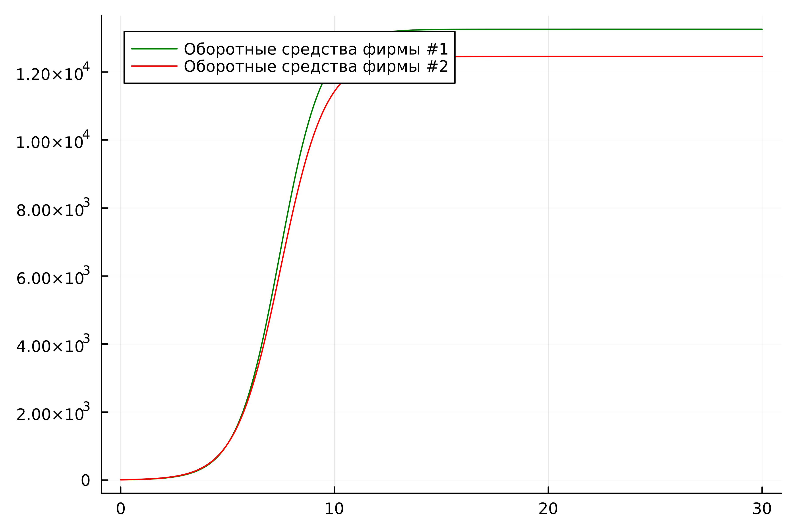
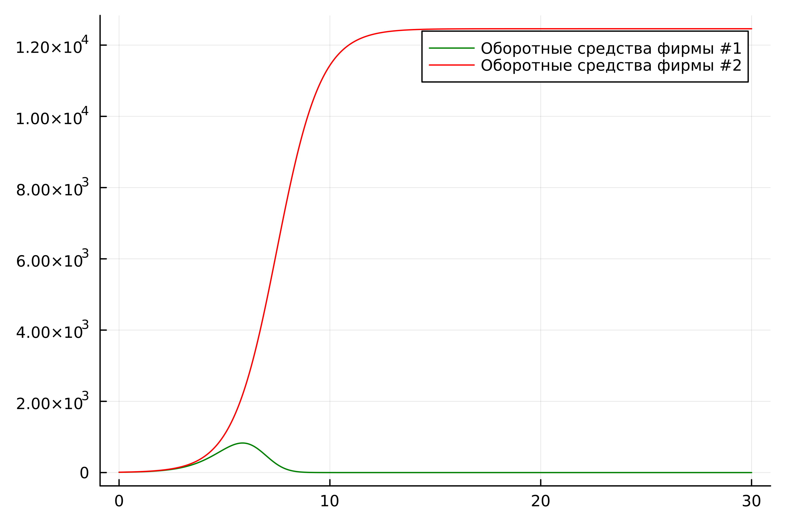
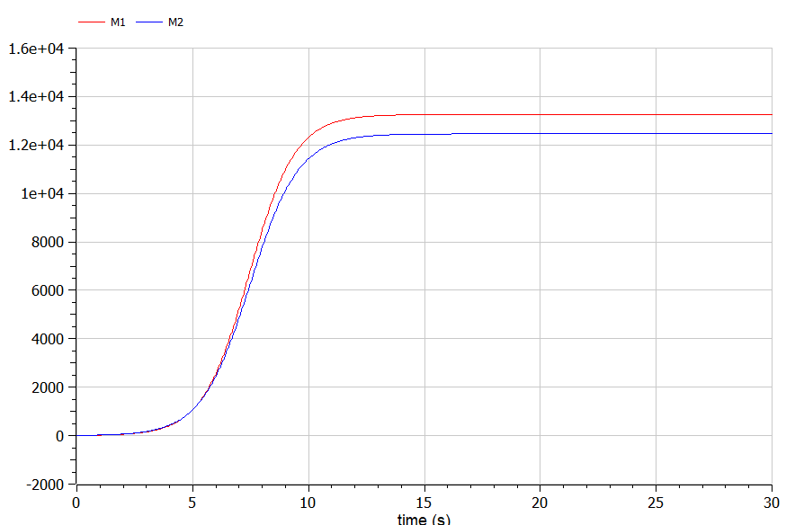
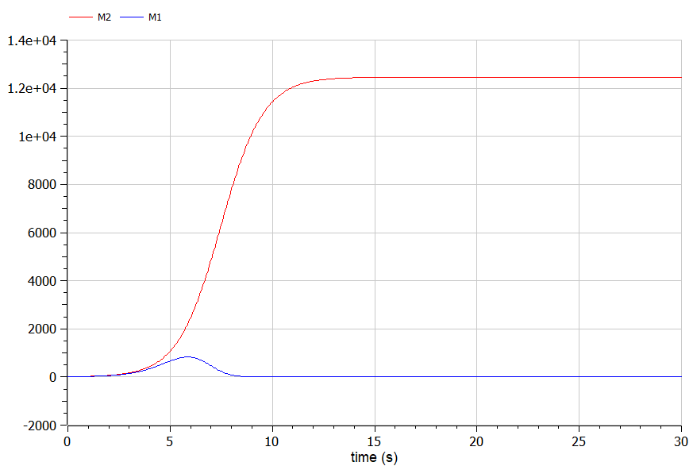

---
## Front matter
lang: ru-RU
title: Лабораторная работа №8
subtitle: Модель конкуренции двух фирм. Вариант №53
author:
  - Чванова Ангелина Дмитриевна
institute:
  - Российский университет дружбы народов, Москва, Россия
date: 19 марта 2024

babel-lang: russian
babel-otherlangs: english
mainfont: Arial
monofont: Courier New
fontsize: 9pt

## Formatting pdf
toc: false
toc-title: Содержание
slide_level: 2
aspectratio: 169
section-titles: true
theme: metropolis
header-includes:
 - \metroset{progressbar=frametitle,sectionpage=progressbar,numbering=fraction}
 - '\makeatletter'
 - '\beamer@ignorenonframefalse'
 - '\makeatother'
---

# Информация

## Докладчик

:::::::::::::: {.columns align=center}
::: {.column width="70%"}

  * Чванова Ангелина Дмитриевна
  * студент
  * Российский университет дружбы народов
  * [angelinachdm@gmail.com](mailto:angelinachdm@gmail.com)
  * <https://adchvanova-new.github.io/ru/>

:::
::: {.column width="30%"}


:::
::::::::::::::
# Цель работы

Изучить и построить модель конкуренции двух фирм.

# Теоретическое введение. Построение математической модели.

Для построения модели конкуренции хотя бы двух фирм необходимо рассмотреть модель одной фирмы.  

$N$ - число потребителей производимого продукта. 

$S$ – доходы потребителей данного продукта. 

$M$ – оборотные средства предприятия 

$\tau$ - длительность производственного цикла

$p$ - рыночная цена товара 

$\widetilde{p}$ - себестоимость продукта, то есть переменные издержки на производство единицы продукции

$\delta$ - доля оборотных средств, идущая на покрытие переменных издержек

$k$ - постоянные издержки, которые не зависят от количества выпускаемой продукции

$Q(S/p)$ – функция спроса, зависящая от отношения дохода $S$ к цене $p$. 


# Задание

**Вариант 53 Случай 1**

Рассмотрим две фирмы, производящие взаимозаменяемые товары одинакового качества и находящиеся в одной рыночной нише. Считаем, что в рамках нашей модели конкурентная борьба ведётся только рыночными методами. 

$$\frac{dM_1}{d\Theta} = M_1 - \frac{b}{c_1}M_1 M_2 - \frac{a1}{c1} M_1^2 $$

$$ \frac{dM_2}{d\Theta} = \frac{c_2}{c_1} M_2 - \frac{b}{c_1} M_1 M_2 - \frac{a_2}{c_1} M_2^2$$
где 

$$ a_1 = \frac{p_{cr}}{\tau_1^2 \widetilde{p}_1^2 Nq } $$
$$ a_2 = \frac{p_{cr}}{\tau_2^2 \widetilde{p}_2^2 Nq } $$ 
$$ b = \frac{p_{cr}}{\tau_1^2 \widetilde{p}_1^2 \tau_2^2 \widetilde{p}_2^2 Nq} $$
$$ c_1 = \frac{p_{cr} - \widetilde{p}_1}{\tau_1 \widetilde{p}_1} $$
$$ c_2 = \frac{p_{cr} - \widetilde{p}_2}{\tau_2 \widetilde{p}_2} $$

# Задание

**Вариант 53 Случай 2**

Рассмотрим модель, когда, помимо экономического фактора влияния (изменение себестоимости, производственного цикла, использование кредита и т.п.), используются еще и социально-психологические факторы – формирование общественного предпочтения одного товара другому, не зависимо от их качества и цены. 

$$\frac{dM_1}{d\Theta} = M_1 - (\frac{b}{c_1} + 0.00043)M_1 M_2 - \frac{a1}{c1} M_1^2 $$

$$ \frac{dM_2}{d\Theta} = \frac{c_2}{c_1} M_2 - \frac{b}{c_1} M_1 M_2 - \frac{a_2}{c_1} M_2^2$$

Для обоих случаев рассмотрим задачу со следующими начальными условиями и параметрами

$$ M_0^1=7.8 \: M_0^2=9.8 $$
$$ p_{cr}=48 \: N=50 \: q=1 $$
$$ \tau_1=34 \: \tau_2=28 $$
$$ \widetilde{p}_1=9ю8 \: \widetilde{p}_2=11.8 $$

# Задачи

1.	Изучить модель конкуренции двух фирм

2.	Построить графики изменения оборотных средств двух фирм для обоих случаев

# Выполнение лабораторной работы

### Julia

Код программы для первого случая:

```
using Plots
using DifferentialEquations


kr=48
t1=34
t2=28
p1=9.8
p2=11.8
N=50
q=1

```
# Выполнение лабораторной работы

### Julia

```
a1=kr/(t1*t1*p1*p1*N*q)
a2=kr/(t2*t2*p2*p2*N*q)
b=kr/(t1*t1*t2*t2*p1*p1*p2*p2*N*q)
c1=(kr-p1)/(t1*p1)
c2=(kr-p2)/(t2*p2)

function func1(du,u,p,t)
	M1,M2=u
	du[1]=u[1]-b/c1*u[1]*u[2]-a1/c1*u[1]*u[1]
	du[2]=c2/c1*u[2]-b/c1*u[1]*u[2]-a2/c1*u[2]*u[2]
end
```
# Выполнение лабораторной работы

### Julia

```
v0= [7.8,9.8]
interval=(0.0,30.0)
problem=ODEProblem(func1,v0,interval)
solution=solve(problem,dtmax=0.05)
M1=[u[1] for u in solution.u]
M2=[u[2] for u in solution.u]
T=[t for t in solution.t]
```
# Выполнение лабораторной работы

### Julia

```
plt = plot(
  dpi = 600,
  legend = true)

plot!(plt, T, M1, label = "Оборотные средства фирмы #1", color = :green)

plot!(plt, T, M2, label = "Оборотные средства фирмы #2", color = :red)

savefig(plt, "lab08_1.png")
```

# Результаты работы кода на Julia

{ #fig:001 width=70% height=70% }

# Результаты работы кода на Julia

{ #fig:002 width=70% height=70% }

# OpenModelica

Код программы для первого случая:

```
model lab08_1
Real kr = 48 ;
Real t1 = 34 ;
Real p1 = 9.8 ;
Real t2 = 28;
Real p2 = 11.8;
Real N = 50;
Real q = 1;
```
# OpenModelica
```
Real a1 = kr / (t1 * t1 * p1 * p1 * N * q);
Real a2 = kr / (t2 * t2 * p2 * p2 * N * q);
Real b = kr / (t1 * t1 * t2 * t2 * p1 * p1 * p2 * p2 * N * q);
Real c1 = (kr - p1) / (t1 * p1);
Real c2 = (kr - p2) / (t2 * p2);

```
# OpenModelica
```

Real M1;
Real M2;
initial equation
M1 = 7.8;
M2 = 9.8;
equation
der(M1) = M1 - b / c1 * M1 * M2 - a1 / c1 * M1 * M1;
der(M2) = c2 / c1 * M2 - b / c1 * M1 * M2 - a2 / c1 * M2 * M2;
end lab08_1;
```


# Результаты работы кода на OpenModelica

{ #fig:004 width=70% height=70% }

# Результаты работы кода на OpenModelica

{ #fig:005 width=70% height=70% }

# Анализ полученных результатов. Сравнение языков.

В результате проделанной работы на Julia и OpenModelica нами были построены графики изменения оборотных средств для двух фирм для случаев, когда конкурентная борьба ведётся только рыночными методами и когда, помимо экономического фактора влияния, используются еще и социально-психологические факторы. 

# Вывод

В ходе выполнения лабораторной работы нами была изучена модель конкуренции двух фирм, а также построена модель на Julia и Open Modelica.

# Список литературы. Библиография.

[1] Документация по Julia: https://docs.julialang.org/en/v1/

[2] Документация по OpenModelica: https://openmodelica.org/

[3] Решение дифференциальных уравнений: https://www.wolframalpha.com/

[4] Мальтузианская модель роста: https://www.stolaf.edu//people/mckelvey/envision.dir/malthus.html