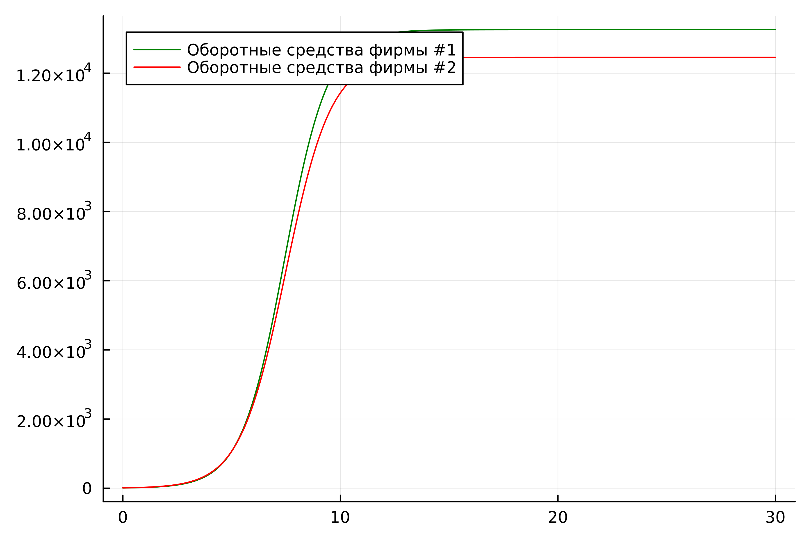
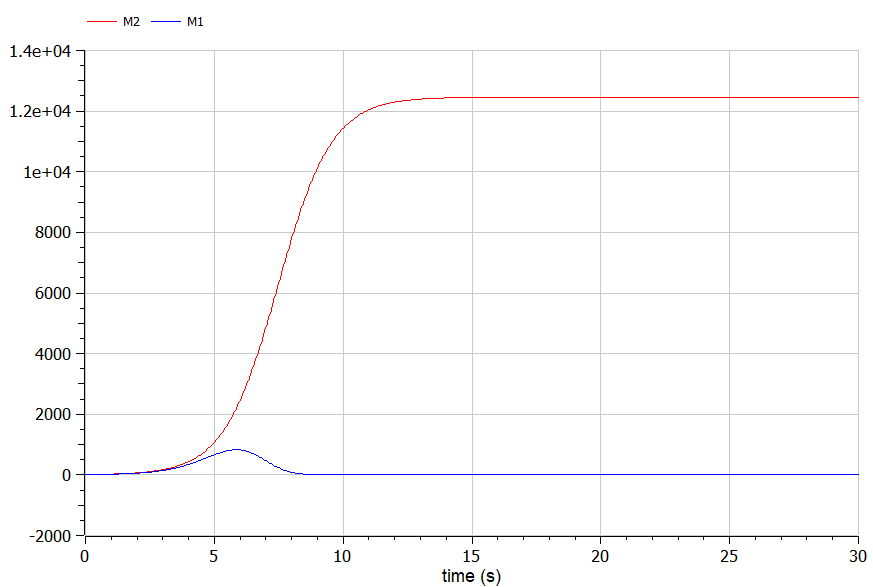

---
## Front matter
title: "Отчёт по лабораторной работе №8
Математическое моделирование"
subtitle: "Модель конкуренции двух фирм. Вариант №53"
author: "Чванова Ангелина Дмитриевна"


## Generic otions
lang: ru-RU
toc-title: "Содержание"

## Bibliography
bibliography: bib/cite.bib
csl: pandoc/csl/gost-r-7-0-5-2008-numeric.csl

## Pdf output format
toc: true # Table of contents
toc-depth: 2
lof: true # List of figures
fontsize: 12pt
linestretch: 1.5
papersize: a4
documentclass: scrreprt
## I18n polyglossia
polyglossia-lang:
  name: russian
  options:
	- spelling=modern
	- babelshorthands=true
polyglossia-otherlangs:
  name: english
## I18n babel
babel-lang: russian
babel-otherlangs: english
## Fonts
mainfont: PT Serif
romanfont: PT Serif
sansfont: PT Sans
monofont: PT Mono
mainfontoptions: Ligatures=TeX
romanfontoptions: Ligatures=TeX
sansfontoptions: Ligatures=TeX,Scale=MatchLowercase
monofontoptions: Scale=MatchLowercase,Scale=0.9
## Biblatex
biblatex: true
biblio-style: "gost-numeric"
biblatexoptions:
  - parentracker=true
  - backend=biber
  - hyperref=auto
  - language=auto
  - autolang=other*
  - citestyle=gost-numeric
## Pandoc-crossref LaTeX customization
figureTitle: "Рис."
tableTitle: "Таблица"
listingTitle: "Листинг"
lofTitle: "Список иллюстраций"
lolTitle: "Листинги"
## Misc options
indent: true
header-includes:
  - \usepackage{indentfirst}
  - \usepackage{float} # keep figures where there are in the text
  - \floatplacement{figure}{H} # keep figures where there are in the text
---

# Цель работы

Изучить и построить модель конкуренции двух фирм.

# Теоретическое введение. Построение математической модели.

Для построения модели конкуренции хотя бы двух фирм необходимо рассмотреть модель одной фирмы. Вначале рассмотрим модель фирмы, производящей продукт долговременного пользования, когда цена его определяется балансом спроса и предложения. Примем, что этот продукт занимает определенную нишу рынка и конкуренты в ней отсутствуют. 

Обозначим:

$N$ - число потребителей производимого продукта. 

$S$ – доходы потребителей данного продукта. Считаем, что доходы всех потребителей одинаковы. Это предположение справедливо, если речь идет об одной рыночной нише, т.е. производимый продукт ориентирован на определенный слой населения. 

$M$ – оборотные средства предприятия 

$\tau$ - длительность производственного цикла

$p$ - рыночная цена товара 

$\widetilde{p}$ - себестоимость продукта, то есть переменные издержки на производство единицы продукции

$\delta$ - доля оборотных средств, идущая на покрытие переменных издержек

$k$ - постоянные издержки, которые не зависят от количества выпускаемой продукции

$Q(S/p)$ – функция спроса, зависящая от отношения дохода $S$ к цене $p$. Она равна количеству продукта, потребляемого одним потребителем в единицу времени.

Функцию спроса товаров долговременного использования часто представляют в простейшей форме: 

$$Q = q - k\frac{p}{S} = q(1 - \frac{p}{p_{cr}})$$

где $q$ – максимальная потребность одного человека в продукте в единицу времени.
Эта функция падает с ростом цены и при $p = p_{cr}$ (критическая стоимость продукта) потребители отказываются от приобретения товара. Величина $p_{cr} = Sq/k$. Параметр $k$ – мера эластичности функции спроса по цене. Таким образом, функция спроса является пороговой (то есть, $Q(S/p) = 0$ при $p \geq p_{cr}$) и обладает свойствами насыщения.

Уравнения динамики оборотных средств можно записать в виде:

$$\frac{dM}{dt} = -\frac{M \delta}{\tau} + NQp - k = -\frac{M\delta}{\tau} + Nq(1 - \frac{p}{p_{cr}})p - k$$

Уравнение для рыночной цены $p$ представим в виде:

$$\frac{dp}{dt} = \gamma (-\frac{M\delta}{\tau \widetilde{p}} + Nq(1-\frac{p}{p_{cr}}) )$$

Первый член соответствует количеству поставляемого на рынок товара (то есть, предложению), а второй член – спросу.
Параметр $\gamma$ зависит от скорости оборота товаров на рынке. Как правило, время торгового оборота существенно меньше времени производственного цикла $\tau$. При заданном M уравнение описывает быстрое стремление цены к равновесному значению цены, которое устойчиво.

В этом случае уравнение можно заменить алгебраическим соотношением

$$ -\frac{M\delta}{\tau \widetilde{p}} + Nq(1-\frac{p}{p_{cr}}) = 0$$

равновесное значение цены $p$ равно

$$ p = p_{cr}(1 - \frac{M\delta}{\tau \widetilde{p} Nq})$$

Тогда уравнения динамики оборотных средств приобретает вид

$$\frac{dM}{dt} = -\frac{M \delta}{\tau}(\frac{p}{p_{cr}}-1) - M^2 ( \frac{\delta}{\tau \widetilde{p} })^2 \frac{p_{cr}}{Nq} - k$$

Это уравнение имеет два стационарных решения, соответствующих условию $dM/dt=0$

$$ \widetilde{M_{1,2}} = \frac{1}{2} a \pm \sqrt{\frac{a^2}{4} - b}$$

где

$$ a = Nq(1 - \frac{\widetilde{p}}{p_{cr}} \widetilde{p} \frac{\tau}{\delta}), b = kNq \frac{(\tau \widetilde{p})^2}{p_{cr}\delta ^2} $$

Получается, что при больших постоянных издержках (в случае $a^2 < 4b$) стационарных состояний нет. Это означает, что в этих условиях фирма не может функционировать стабильно, то есть, терпит банкротство. Однако, как правило, постоянные затраты малы по сравнению с переменными (то есть, $b << a^2$) и играют роль, только в случае, когда оборотные средства малы. 

При $b << a$ стационарные значения $M$ равны

$$ \widetilde{M_{+}} = Nq \frac{\tau}{\delta}(1 - \frac{\widetilde{p}}{p_{cr}})\widetilde{p}, \widetilde{M_{-}} = k\widetilde{p} \frac{\tau}{\delta(p_{cr} - \widetilde{p})} $$

Первое состояние $\widetilde{M_{+}}$ устойчиво и соответствует стабильному функционированию предприятия. Второе состояние \widetilde{M_{-} неустойчиво, так, что при $M < \widetilde{M_{-}}$ оборотные средства падают ($dM/dt < 0$), то есть, фирма идет к банкротству. По смыслу $\widetilde{M_{-}}$ соответствует начальному капиталу, необходимому для входа в рынок.

В обсуждаемой модели параметр $\delta$ всюду входит в сочетании с $\tau$. Это значит, что уменьшение доли оборотных средств, вкладываемых в производство, эквивалентно удлинению производственного цикла. Поэтому мы в дальнейшем положим: $\delta = 1$, а параметр $\tau$ будем считать временем цикла, с учётом сказанного.

# Задание

**Вариант 53 **

>Случай 1

Рассмотрим две фирмы, производящие взаимозаменяемые товары одинакового качества и находящиеся в одной рыночной нише. Считаем, что в рамках нашей модели конкурентная борьба ведётся только рыночными методами. То есть, конкуренты могут влиять на противника путем изменения параметров своего производства: себестоимость, время цикла, но не могут прямо вмешиваться в ситуацию на рынке («назначать» цену или влиять на потребителей каким-либо иным способом.) Будем считать, что постоянные издержки пренебрежимо малы, и в модели учитывать не будем. В этом случае динамика изменения объемов продаж фирмы 1 и фирмы 2 описывается следующей системой уравнений:

$$\frac{dM_1}{d\Theta} = M_1 - \frac{b}{c_1}M_1 M_2 - \frac{a1}{c1} M_1^2 $$

$$ \frac{dM_2}{d\Theta} = \frac{c_2}{c_1} M_2 - \frac{b}{c_1} M_1 M_2 - \frac{a_2}{c_1} M_2^2$$
где 

$$ a_1 = \frac{p_{cr}}{\tau_1^2 \widetilde{p}_1^2 Nq } $$
$$ a_2 = \frac{p_{cr}}{\tau_2^2 \widetilde{p}_2^2 Nq } $$ 
$$ b = \frac{p_{cr}}{\tau_1^2 \widetilde{p}_1^2 \tau_2^2 \widetilde{p}_2^2 Nq} $$
$$ c_1 = \frac{p_{cr} - \widetilde{p}_1}{\tau_1 \widetilde{p}_1} $$
$$ c_2 = \frac{p_{cr} - \widetilde{p}_2}{\tau_2 \widetilde{p}_2} $$

также введена нормировка $t = c_1 \Theta$

>Случай 2

Рассмотрим модель, когда, помимо экономического фактора влияния (изменение себестоимости, производственного цикла, использование кредита и т.п.), используются еще и социально-психологические факторы – формирование общественного предпочтения одного товара другому, не зависимо от их качества и цены. В этом случае взаимодействие двух фирм будет зависеть друг от друга, соответственно коэффициент перед $M_1 M_2$ будет отличаться. Пусть в рамках рассматриваемой модели динамика изменения объемов продаж фирмы 1 и фирмы 2 описывается следующей системой уравнений:

$$\frac{dM_1}{d\Theta} = M_1 - (\frac{b}{c_1} + 0.00043)M_1 M_2 - \frac{a1}{c1} M_1^2 $$

$$ \frac{dM_2}{d\Theta} = \frac{c_2}{c_1} M_2 - \frac{b}{c_1} M_1 M_2 - \frac{a_2}{c_1} M_2^2$$

Для обоих случаев рассмотрим задачу со следующими начальными условиями и параметрами

$$ M_0^1=7.8 \: M_0^2=9.8 $$
$$ p_{cr}=48 \: N=50 \: q=1 $$
$$ \tau_1=34 \: \tau_2=28 $$
$$ \widetilde{p}_1=9ю8 \: \widetilde{p}_2=11.8 $$

# Задачи

1.	Изучить модель конкуренции двух фирм

2.	Построить графики изменения оборотных средств двух фирм для обоих случаев

# Выполнение лабораторной работы

## Решение с помощью программ

### Julia

Код программы для первого случая:

```
using Plots
using DifferentialEquations


kr=48
t1=34
t2=28
p1=9.8
p2=11.8
N=50
q=1

a1=kr/(t1*t1*p1*p1*N*q)
a2=kr/(t2*t2*p2*p2*N*q)
b=kr/(t1*t1*t2*t2*p1*p1*p2*p2*N*q)
c1=(kr-p1)/(t1*p1)
c2=(kr-p2)/(t2*p2)

function func1(du,u,p,t)
	M1,M2=u
	du[1]=u[1]-b/c1*u[1]*u[2]-a1/c1*u[1]*u[1]
	du[2]=c2/c1*u[2]-b/c1*u[1]*u[2]-a2/c1*u[2]*u[2]
end

v0= [7.8,9.8]
interval=(0.0,30.0)
problem=ODEProblem(func1,v0,interval)
solution=solve(problem,dtmax=0.05)
M1=[u[1] for u in solution.u]
M2=[u[2] for u in solution.u]
T=[t for t in solution.t]

plt = plot(
  dpi = 600,
  legend = true)

plot!(plt, T, M1, label = "Оборотные средства фирмы #1", color = :green)

plot!(plt, T, M2, label = "Оборотные средства фирмы #2", color = :red)

savefig(plt, "lab08_1.png")
```

Код программы для второго случая:

```
using Plots
using DifferentialEquations

kr=48
t1=34
t2=28
p1=9.8
p2=11.8
N=50
q=1

a1 = kr / (t1 * t1 * p1 * p1 * N * q)
a2 = kr / (t2 * t2 * p2 * p2 * N *q)
b = kr / (t1 * t1 * t2 * t2 * p1 * p1 * p2 * p2 * N * q)
c1 = (kr - p1) / (t1 * p1)
c2 = (kr - p2) / (t2 * p2)


function func2(du, u, p, t)
    M1, M2 = u
    du[1] = u[1] - (b / c1 + 0.00043)*u[1] * u[2] - a1 / c1*u[1] * u[1]
    du[2] = c2 / c1*u[2] - b / c1*u[1] * u[2] - a2 / c1*u[2] * u[2]
end

v0= [7.8,9.8]
interval=(0.0,30.0)
problem=ODEProblem(func2,v0,interval)
solution=solve(problem,dtmax=0.05)
M1=[u[1] for u in solution.u]
M2=[u[2] for u in solution.u]
T=[t for t in solution.t]

plt = plot(
  dpi = 600,
  legend = :topright)

plot!(plt, T, M1, label = "Оборотные средства фирмы #1", color = :green)

plot!(plt, T, M2, label = "Оборотные средства фирмы #2", color = :red)

savefig(plt, "lab08_2.png")
```

### Результаты работы кода на Julia

{ #fig:001 width=70% height=70% }

{ #fig:002 width=70% height=70% }

## OpenModelica

Код программы для первого случая:

```
model lab08_1
Real kr = 48 ;
Real t1 = 34 ;
Real p1 = 9.8 ;
Real t2 = 28;
Real p2 = 11.8;
Real N = 50;
Real q = 1;

Real a1 = kr / (t1 * t1 * p1 * p1 * N * q);
Real a2 = kr / (t2 * t2 * p2 * p2 * N * q);
Real b = kr / (t1 * t1 * t2 * t2 * p1 * p1 * p2 * p2 * N * q);
Real c1 = (kr - p1) / (t1 * p1);
Real c2 = (kr - p2) / (t2 * p2);

Real M1;
Real M2;
initial equation
M1 = 7.8;
M2 = 9.8;
equation
der(M1) = M1 - b / c1 * M1 * M2 - a1 / c1 * M1 * M1;
der(M2) = c2 / c1 * M2 - b / c1 * M1 * M2 - a2 / c1 * M2 * M2;
end lab08_1;
```

Код программы для второго случая:

```
model lab08_2
Real kr = 48 ;
Real t1 = 34 ;
Real p1 = 9.8 ;
Real t2 = 28;
Real p2 = 11.8;
Real N = 50;
Real q = 1;

Real a1 = kr / (t1 * t1 * p1 * p1 * N * q);
Real a2 = kr / (t2 * t2 * p2 * p2 * N * q);
Real b = kr / (t1 * t1 * t2 * t2 * p1 * p1 * p2 * p2 * N * q);
Real c1 = (kr - p1) / (t1 * p1);
Real c2 = (kr - p2) / (t2 * p2);

Real M1;
Real M2;
initial equation
M1 = 7.8;
M2 = 9.8;
equation
der(M1) = M1 - (b / c1 + 0.00043) * M1 * M2 - a1 / c1 * M1 * M1;
der(M2) = c2 / c1 * M2 - b / c1 * M1 * M2 - a2 / c1 * M2 * M2;
end lab08_2;
```

### Результаты работы кода на OpenModelica

{ #fig:004 width=70% height=70% }

{ #fig:005 width=70% height=70% }

# Анализ полученных результатов. Сравнение языков.

В результате проделанной работы на Julia и OpenModelica нами были построены графики изменения оборотных средств для двух фирм для случаев, когда конкурентная борьба ведётся только рыночными методами и когда, помимо экономического фактора влияния, используются еще и социально-психологические факторы. 

# Вывод

В ходе выполнения лабораторной работы нами была изучена модель конкуренции двух фирм, а также построена модель на Julia и Open Modelica.

# Список литературы. Библиография.

[1] Документация по Julia: https://docs.julialang.org/en/v1/

[2] Документация по OpenModelica: https://openmodelica.org/

[3] Решение дифференциальных уравнений: https://www.wolframalpha.com/

[4] Мальтузианская модель роста: https://www.stolaf.edu//people/mckelvey/envision.dir/malthus.html